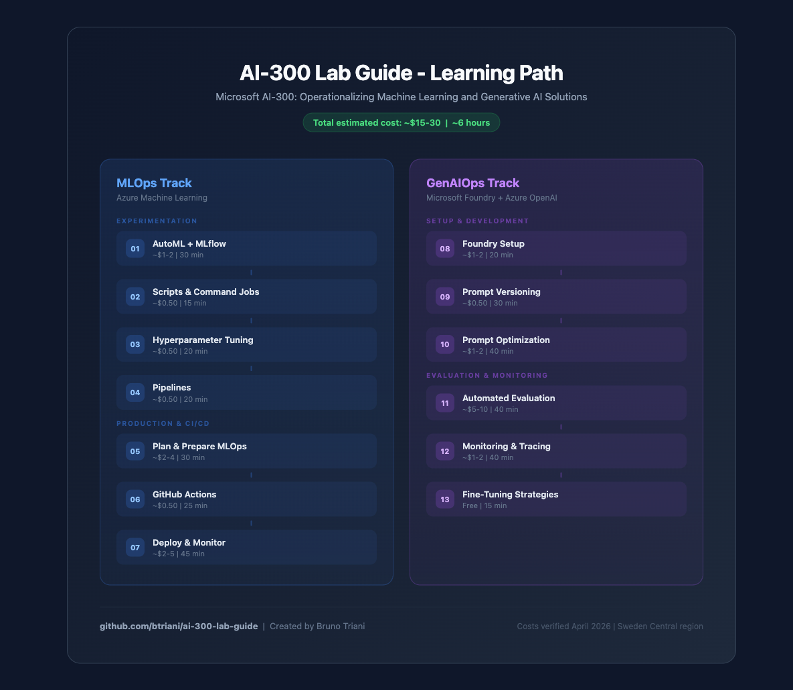
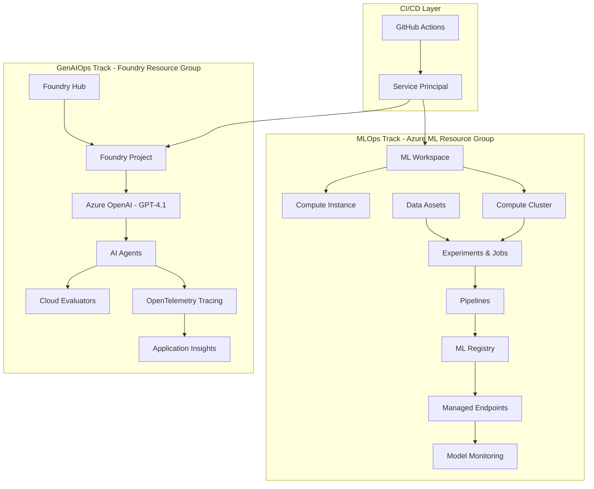

# AI-300 Lab Guide

Hands-on guide for the Microsoft AI-300: Operationalizing Machine Learning and Generative AI Solutions exam.

All 13 labs from the official Microsoft Learn curriculum, reorganized into a single linear path with architecture diagrams, cost estimates, and exam tips.

## Who This Is For

- Preparing for the AI-300 exam
- Have an Azure subscription (pay-as-you-go is fine)
- Comfortable with CLI basics (each lab explains what you need)

## Quick Start

1. Clone this repo: `git clone https://github.com/btriani/ai-300-lab-guide.git`
2. Run the prerequisites check: `./scripts/check-prerequisites.sh`
3. Start with [Lab 01](labs/01-automl-mlflow/workbook.md)

## Labs

| # | Lab | Track | Est. Cost | Est. Time |
|---|-----|-------|-----------|-----------|
| 01 | [AutoML + MLflow](labs/01-automl-mlflow/workbook.md) | MLOps | ~$1-2 | 30 min |
| 02 | [Scripts & Command Jobs](labs/02-scripts-command-jobs/workbook.md) | MLOps | ~$0.50 | 15 min |
| 03 | [Hyperparameter Tuning](labs/03-hyperparameter-tuning/workbook.md) | MLOps | ~$0.50 | 20 min |
| 04 | [Pipelines](labs/04-pipelines/workbook.md) | MLOps | ~$0.50 | 20 min |
| 05 | [Plan & Prepare MLOps](labs/05-plan-prepare-mlops/workbook.md) | MLOps | ~$2-4 | 30 min |
| 06 | [GitHub Actions](labs/06-github-actions/workbook.md) | MLOps | ~$0.50 | 25 min |
| 07 | [Deploy & Monitor](labs/07-deploy-monitor/workbook.md) | MLOps | ~$2-5 | 45 min |
| 08 | [Foundry Setup](labs/08-foundry-setup/workbook.md) | GenAIOps | ~$1-2 | 20 min |
| 09 | [Prompt Versioning](labs/09-prompt-versioning/workbook.md) | GenAIOps | ~$0.50 | 30 min |
| 10 | [Prompt Optimization](labs/10-prompt-optimization/workbook.md) | GenAIOps | ~$1-2 | 40 min |
| 11 | [Automated Evaluation](labs/11-automated-evaluation/workbook.md) | GenAIOps | ~$5-10 | 40 min |
| 12 | [Monitoring & Tracing](labs/12-monitoring-tracing/workbook.md) | GenAIOps | ~$1-2 | 40 min |
| 13 | [Fine-Tuning Strategies](labs/13-fine-tuning/workbook.md) | GenAIOps | Free | 15 min |

**Total estimated cost: ~$15-30** | **Total time: ~6 hours**

See [COST-GUIDE.md](COST-GUIDE.md) for per-service pricing and how to minimize spend.

## Architecture Overview

## Cheatsheets

- [MLOps Cheatsheet](cheatsheets/mlops-cheatsheet.md) - CLI commands, key concepts, common patterns
- [GenAIOps Cheatsheet](cheatsheets/genaiops-cheatsheet.md) - azd commands, Foundry concepts, evaluation patterns

## Scripts

| Script | Purpose |
|--------|---------|
| `scripts/check-prerequisites.sh` | Verify all tools are installed |
| `scripts/setup-mlops.sh` | One-command MLOps infrastructure setup |
| `scripts/setup-genaiops.sh` | One-command GenAIOps infrastructure setup |
| `scripts/cleanup-all.sh` | Delete all Azure resources when done |

## Official Microsoft Resources

- [MLOps Labs](https://microsoftlearning.github.io/mslearn-mlops/)
- [GenAIOps Labs](https://microsoftlearning.github.io/mslearn-genaiops/)
- [AI-300 Exam Page](https://learn.microsoft.com/en-us/credentials/certifications/exams/ai-300/)

## Contributing

Found an error or have a suggestion? Open an issue or PR.

## License

[MIT](LICENSE)
