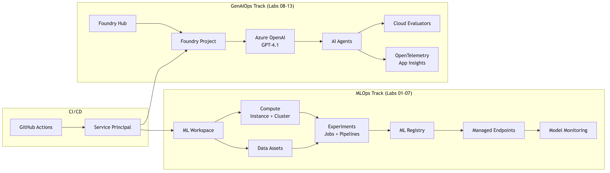

# AI-300 Lab Guide

Hands-on guide for the Microsoft AI-300: Operationalizing Machine Learning and Generative AI Solutions exam.

All 13 labs from the official Microsoft Learn curriculum, reorganized into runnable Jupyter notebooks with standalone Python SDK scripts, architecture diagrams, cost estimates, and exam tips.

> **Attribution:** All lab content is adapted from [Microsoft Learning](https://github.com/MicrosoftLearning). See [ATTRIBUTION.md](ATTRIBUTION.md) for details.

## Architecture Overview

## Who This Is For

- Preparing for the AI-300 exam
- Have an Azure subscription (pay-as-you-go is fine)
- Comfortable with CLI basics (each lab explains what you need)

## Quick Start

1. Clone this repo: `git clone https://github.com/btriani/ai-300-lab-guide.git`
2. Run the prerequisites check: `./scripts/check-prerequisites.sh`
3. Install MLOps dependencies: `pip install -r mlops/requirements.txt`
4. Provision MLOps infrastructure: `./scripts/setup-mlops.sh`
5. Start with [Lab 01](mlops/lab01-automl-mlflow/lab01-automl-mlflow.ipynb)

## Labs

### MLOps Track

| # | Lab | Notebook | Est. Cost | Est. Time |
|---|-----|----------|-----------|-----------|
| 01 | AutoML + MLflow | [lab01-automl-mlflow.ipynb](mlops/lab01-automl-mlflow/lab01-automl-mlflow.ipynb) | ~$1-2 | 30 min |
| 02 | Scripts & Command Jobs | [lab02-scripts-command-jobs.ipynb](mlops/lab02-scripts-command-jobs/lab02-scripts-command-jobs.ipynb) | ~$0.50 | 15 min |
| 03 | Hyperparameter Tuning | [lab03-hyperparameter-tuning.ipynb](mlops/lab03-hyperparameter-tuning/lab03-hyperparameter-tuning.ipynb) | ~$0.50 | 20 min |
| 04 | Pipelines | [lab04-pipelines.ipynb](mlops/lab04-pipelines/lab04-pipelines.ipynb) | ~$0.50 | 20 min |
| 05 | Plan & Prepare MLOps | [lab05-plan-prepare-mlops.ipynb](mlops/lab05-plan-prepare-mlops/lab05-plan-prepare-mlops.ipynb) | ~$2-4 | 30 min |
| 06 | GitHub Actions | [lab06-github-actions.ipynb](mlops/lab06-github-actions/lab06-github-actions.ipynb) | ~$0.50 | 25 min |
| 07 | Deploy & Monitor | [lab07-deploy-monitor.ipynb](mlops/lab07-deploy-monitor/lab07-deploy-monitor.ipynb) | ~$2-5 | 45 min |

### GenAIOps Track

| # | Lab | Notebook | Est. Cost | Est. Time |
|---|-----|----------|-----------|-----------|
| 08 | Foundry Setup | [lab08-foundry-setup.ipynb](genaiops/lab08-foundry-setup/lab08-foundry-setup.ipynb) | ~$1-2 | 20 min |
| 09 | Prompt Versioning | [lab09-prompt-versioning.ipynb](genaiops/lab09-prompt-versioning/lab09-prompt-versioning.ipynb) | ~$0.50 | 30 min |
| 10 | Prompt Optimization | [lab10-prompt-optimization.ipynb](genaiops/lab10-prompt-optimization/lab10-prompt-optimization.ipynb) | ~$1-2 | 40 min |
| 11 | Automated Evaluation | [lab11-automated-evaluation.ipynb](genaiops/lab11-automated-evaluation/lab11-automated-evaluation.ipynb) | ~$5-10 | 40 min |
| 12 | Monitoring & Tracing | [lab12-monitoring-tracing.ipynb](genaiops/lab12-monitoring-tracing/lab12-monitoring-tracing.ipynb) | ~$1-2 | 40 min |
| 13 | Fine-Tuning Strategies | [lab13-fine-tuning.ipynb](genaiops/lab13-fine-tuning/lab13-fine-tuning.ipynb) | Free | 15 min |

**Total estimated cost: ~$15-30** | **Total time: ~6 hours**

See [COST-GUIDE.md](COST-GUIDE.md) for per-service pricing and how to minimize spend.

## Cheatsheets

- [MLOps Cheatsheet](cheatsheets/mlops-cheatsheet.md) -- CLI commands, key concepts, common patterns
- [GenAIOps Cheatsheet](cheatsheets/genaiops-cheatsheet.md) -- azd commands, Foundry concepts, evaluation patterns

## Scripts

| Script | Purpose |
|--------|---------|
| `scripts/check-prerequisites.sh` | Verify all tools are installed |
| `scripts/setup-mlops.sh` | One-command MLOps infrastructure setup |
| `scripts/setup-genaiops.sh` | One-command GenAIOps infrastructure setup |
| `scripts/cleanup-all.sh` | Delete all Azure resources when done |

## Official Microsoft Resources

- [MLOps Labs (original)](https://github.com/MicrosoftLearning/mslearn-mlops)
- [GenAIOps Labs (original)](https://github.com/MicrosoftLearning/mslearn-genaiops)
- [AI-300 Exam Page](https://learn.microsoft.com/en-us/credentials/certifications/exams/ai-300/)

## License

[MIT](LICENSE) -- see [ATTRIBUTION.md](ATTRIBUTION.md) for Microsoft source attribution.
