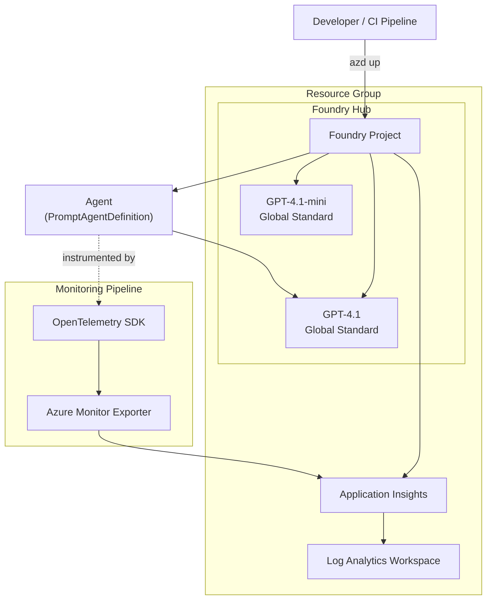

# GenAIOps Cheat Sheet

## 1. Service Map



**Hierarchy:** Hub (shared governance) > Project (scoped workspace) > Agent / Model Deployment

---

## 2. CLI Commands Reference

### azd (Azure Developer CLI -- infrastructure-as-code)

| Command | Purpose |
|---------|---------|
| `azd auth login` | Authenticate azd to Azure |
| `azd up` | Package + provision (Bicep) + deploy -- single command for entire stack |
| `azd down` | Tear down all provisioned resources |
| `azd env new <name>` | Create a new environment |
| `azd env set <key> <val>` | Set an environment variable in current azd env |
| `azd env get-values > .env` | Export all env vars to `.env` file for local scripts |
| `azd deploy` | Redeploy app code without re-provisioning infrastructure |

### az (Azure CLI -- resource management & identity)

| Command | Purpose |
|---------|---------|
| `az login` | Interactive login to Azure |
| `az ad sp create-for-rbac` | Create a service principal for CI/CD |
| `az role assignment create` | Assign RBAC role (e.g., Contributor) to an identity |
| `az ad app federated-credential create` | Add OIDC federated credential for GitHub Actions |

### Python Scripts (src/api/)

| Script | Purpose |
|--------|---------|
| `trail_guide_agent.py` | Deploy/update the agent in Foundry |
| `interact_with_agent.py` | Interactive chat session with the deployed agent |
| `run_batch_tests.py` | Run standardized test prompts; save responses for scoring |
| `evaluate_agent.py` | Automated evaluation pipeline (upload, define, run, poll, retrieve) |
| `run_monitoring.py` | Emit OpenTelemetry traces for all agent versions to App Insights |
| `check_traces.py` | Query and display trace trees from Application Insights |

---

## 3. UI Navigation Paths -- Foundry Portal (ai.azure.com)

| Section | Path | What You See |
|---------|------|--------------|
| **Agents** | Project > Agents | Deployed agents, system prompts, model bindings |
| **Evaluations** | Project > Evaluations | Evaluation runs, per-item scores, aggregate metrics |
| **Monitoring** | Project > Monitoring / Azure Monitor | Traces, token usage, latency, error rates |
| **Models** | Project > Models + endpoints | Model deployments, deployment types |
| **Data** | Project > Data | Uploaded datasets (evaluation JSONL files) |

---

## 4. Key Concepts

### Foundry Hub vs. Project

| | Hub | Project |
|-|-----|---------|
| **Scope** | Shared governance boundary | Scoped workspace |
| **Contains** | Connections, compute, model deployments | Agents, evaluations, datasets, traces |
| **Shared across** | Multiple projects | Single team / application |

### Agents (PromptAgentDefinition)

- **Stateful resource** in Foundry -- persists system prompt, model binding, and tool definitions
- Not an ephemeral API call; the agent retains config between sessions
- Created via Azure AI Projects SDK (`client.agents.create()`)

### Prompt Versioning

- Use **Git tags** (v1, v2, v3, v4) for release versions
- Use **branches** for experiments (e.g., `experiment/v4-concise`)
- **main branch** = production truth
- Prompts are the "model" in GenAIOps -- version them like ML models

### Cloud Evaluators (LLM-as-Judge)

| Evaluator | Measures | Question It Answers |
|-----------|----------|---------------------|
| **Intent Resolution** | Does the response address the user's actual question? | Did you answer the right question? |
| **Relevance** | Is all response content relevant? No filler? | Is everything in the response useful? |
| **Groundedness** | Is the response factually grounded? No hallucinations? | Is it true and supported by context? |

- Scores: **1-5 scale** (1 = worst, 5 = best)
- These are **separate LLM calls** that judge the agent's output -- evaluation has its own token cost
- `data_mapping` uses `${data.field_name}` syntax to bind dataset columns to evaluator inputs

### Evaluation Datasets (JSONL)

- Format: one JSON object per line
- Each object contains: `query`, `response` (or expected output), `context`
- Small set (5 items) for rapid iteration; large set for statistical significance
- Registered as versioned dataset assets in Foundry

### OpenTelemetry Spans

- **Span** = unit of work with start time, end time, and attributes
- **Span hierarchy:** parent spans measure aggregates, child spans measure individual operations
- Example: `agent-v4` (parent) > `test-query` (child) > OpenAI SDK call (auto-instrumented)
- `OpenAIInstrumentor().instrument()` auto-captures token counts, model name, latency

### Application Insights

- Receives telemetry via **Azure Monitor Exporter** (bridge from OpenTelemetry)
- Backend: **Log Analytics Workspace** (supports KQL queries)
- Ingestion delay: **2-5 minutes** -- not real-time
- Key metrics: token counts, latency, error rates, request counts

### Fine-Tuning Methods

| Method | Data Needed | Best For | Risk |
|--------|-------------|----------|------|
| **SFT** (Supervised Fine-Tuning) | Labeled (input, output) pairs | Domain knowledge, output format consistency | Catastrophic forgetting |
| **RFT** (Reinforcement Fine-Tuning) | Reward function / reward model | Metric optimization, reasoning improvement | Reward hacking |
| **DPO** (Direct Preference Optimization) | Preference pairs (chosen, rejected) | Style alignment, safety | Inconsistent preferences |

**Decision tree:** Have labeled examples -> SFT. Have evaluators/reward signal -> RFT. Have comparisons (A > B) -> DPO. Have none -> stay with prompt engineering.

### Model Deployment Types

| Type | Capacity | Pricing | Best For |
|------|----------|---------|----------|
| **Global Standard** | Shared multi-tenant | Pay-per-token | Dev/test, experimentation |
| **Provisioned** | Reserved throughput | Fixed cost | Production, guaranteed SLAs |
| **Data Zone** | Region-restricted processing | Varies | Data residency compliance |

---

## 5. Common Patterns

### Prompt Evolution

```
V1 Basic           -> V2 Personalized        -> V3 Production-Ready     -> V4 Optimized
(simple role def)     (clarifying questions,     (structured framework,     (concise, fewer
                       user-aware responses)      grounding, safety)         tokens, same quality)
```

Each version tagged with `git tag -a v1/v2/v3/v4`.

### Git-Based Experimentation

```
main (V3 baseline)
  |
  +-- experiment/v4-concise      (change prompt)
  |     run_batch_tests.py       (same test prompts)
  |     manual scoring CSV       (1-5 scale x 3 criteria)
  |     --> WINNER --> merge to main, tag v4
  |
  +-- experiment/mini-model      (change model)
        run_batch_tests.py       (same test prompts)
        manual scoring CSV
        --> LOSER --> archive branch
```

Rule: change one variable at a time (prompt OR model, not both).

### Automated Evaluation Pipeline

```
Step 1: Upload dataset       client.datasets.upload_file("eval.jsonl")
Step 2: Create eval def      EvaluationDefinition(evaluators={...}, data_mapping={...})
Step 3: Run evaluation       client.evaluations.create(...)
Step 4: Poll for results     while status != "Completed": sleep(30)
Step 5: Retrieve scores      client.evaluations.get(eval_id) -> per-item + aggregate
```

### Monitoring Pipeline

```python
# 1. Configure export
configure_azure_monitor(connection_string=os.getenv("APPLICATIONINSIGHTS_CONNECTION_STRING"))

# 2. Auto-instrument OpenAI calls
OpenAIInstrumentor().instrument()

# 3. Create span hierarchy
tracer = trace.get_tracer(__name__)
with tracer.start_as_current_span("agent-v4") as parent:
    with tracer.start_as_current_span("test-query") as child:
        response = agent.run(query)
        child.set_attribute("response.token_count", response.usage.total_tokens)
```

### CI/CD with OIDC (GitHub Actions)

```yaml
permissions:
  id-token: write    # Required for OIDC
  contents: read

steps:
  - uses: azure/login@v2
    with:
      client-id: ${{ secrets.AZURE_CLIENT_ID }}
      tenant-id: ${{ secrets.AZURE_TENANT_ID }}
      subscription-id: ${{ secrets.AZURE_SUBSCRIPTION_ID }}
  - run: python src/api/evaluate_agent.py
```

---

## 6. Gotchas

| Gotcha | Detail |
|--------|--------|
| **azd up + multiple subscriptions** | Must set subscription ID first: `azd env set AZURE_SUBSCRIPTION_ID <id>` or select when prompted |
| **.env encoding** | Must be **UTF-8**; BOM or other encodings cause silent parse failures |
| **Python version** | **3.10+** required for latest `openai` SDK; 3.9+ for Azure AI SDKs |
| **Federated credentials** | Need **separate configs** for main branch and PRs (different subject claims) |
| **Evaluation scores** | **1-5 scale**; threshold **>= 3** is pass; scores are per-evaluator, not overall |
| **Telemetry delay** | App Insights ingestion takes **2-5 minutes**; traces won't appear instantly |
| **data_mapping syntax** | Uses `${data.field_name}` -- must match JSONL column names exactly |
| **LLM-as-judge cost** | Evaluation runs consume tokens (separate LLM calls to score) -- budget for it |
| **Catastrophic forgetting (SFT)** | Fine-tuned model may lose general capabilities; include general examples in training set |
| **azd vs az** | `azd` = template-based IaC deployments; `az` = individual resource management -- different tools |
| **Evaluation vs monitoring** | Evaluation = quality (is it good?); Monitoring = operations (is it healthy?) -- you need both |
| **Fine-tuning is last resort** | Only when evaluation scores plateau despite prompt optimization |
