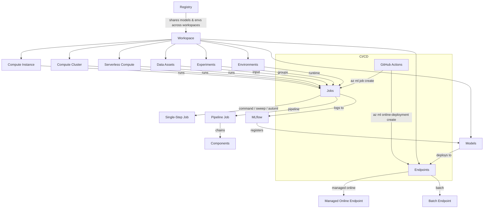

# MLOps Cheat Sheet

## 1. Service Map



---

## 2. CLI Commands Reference

### Workspace & Compute

```bash
# Create workspace
az ml workspace create -g <rg> -n <workspace>

# Compute instance
az ml compute create -n <name> --type ComputeInstance --size Standard_DS3_v2
az ml compute show -n <name>
az ml compute stop -n <name>
az ml compute start -n <name>
az ml compute delete -n <name>

# Compute cluster
az ml compute create -n <name> --type AmlCompute \
  --size Standard_DS3_v2 --min-instances 0 --max-instances 4

# Set defaults (avoids repeating -g and -w every time)
az configure --defaults group=<rg> workspace=<workspace>
```

### Data

```bash
# URI file (single file)
az ml data create --name <name> --path <path-or-url> --type uri_file

# URI folder (directory of files)
az ml data create --name <name> --path <path-or-url> --type uri_folder

# MLTable (tabular with schema)
az ml data create --name <name> --path <folder-with-MLTable-file> --type mltable
```

### Jobs

```bash
# Submit a job from YAML
az ml job create --file job.yml

# Stream logs live (blocks terminal until job completes)
az ml job create --file job.yml --stream

# Check status / list
az ml job show -n <job-name>
az ml job list
```

### Environments

```bash
# Create from YAML (conda + base image)
az ml environment create --file env.yml

# Show details
az ml environment show -n <name> --version <ver>
```

### Models

```bash
# Register model from local path or job output
az ml model create --name <name> --path <path> --type mlflow_model
az ml model create --name <name> \
  --path azureml://jobs/<job-id>/outputs/artifacts/paths/model

az ml model show -n <name> --version <ver>
```

### Endpoints & Deployments

```bash
# Create managed online endpoint
az ml online-endpoint create --file endpoint.yml

# Create deployment under that endpoint
az ml online-deployment create --file deployment.yml --all-traffic

# Test with sample data
az ml online-endpoint invoke -n <endpoint> --request-file sample.json

# Delete
az ml online-endpoint delete -n <endpoint> -y
```

### Registry

```bash
# Create a registry (cross-workspace sharing)
az ml registry create --file registry.yml
```

---

## 3. UI Navigation Paths

### Azure ML Studio (ml.azure.com)

| Task | Click Path |
|---|---|
| View/submit jobs | **Jobs** > select experiment > select run |
| Manage data assets | **Data** > + Create |
| Compute resources | **Compute** > Compute instances / Compute clusters |
| Register models | **Models** > + Register > choose source |
| Deploy models | **Endpoints** > + Create > Managed online / Batch |
| View environments | **Environments** > Custom / Curated tab |
| Build pipelines (Designer) | **Designer** > + New pipeline |
| Pipeline jobs | **Pipelines** (or Jobs filtered to pipeline type) |

### Azure Portal (portal.azure.com)

| Resource | Path |
|---|---|
| AML Workspace | Resource groups > `<rg>` > `<workspace>` |
| Key Vault | Resource groups > `<rg>` > `<keyvault>` > Secrets / Access policies |
| Storage Account | Resource groups > `<rg>` > `<storage>` > Containers / Blobs |
| App Insights | Resource groups > `<rg>` > `<appinsights>` > Logs / Metrics |
| Managed Identity | Workspace resource > Identity blade |

---

## 4. Key Concepts

| Concept | Definition |
|---|---|
| **Workspace** | Top-level resource grouping all AML assets. Linked to storage, key vault, ACR, App Insights. |
| **Compute Instance** | Single-node dev VM. Always on unless manually stopped. Billed while running. |
| **Compute Cluster** | Multi-node auto-scaling cluster. Scales to 0 when idle = no cost. Use for training jobs. |
| **Serverless Compute** | On-demand compute managed by Azure. No cluster to create/manage. Specify in job YAML. |
| **Data Asset: uri_file** | Points to a single file (CSV, parquet, etc.). |
| **Data Asset: uri_folder** | Points to a folder of files. |
| **Data Asset: mltable** | Tabular data with schema (column types, transformations). Requires an MLTable file in the folder. |
| **Experiment** | Logical grouping of job runs. Name set via `experiment_name` in job YAML. |
| **Command Job** | Runs a single script with specified environment and compute. |
| **Sweep Job** | Hyperparameter tuning. Wraps a command job with a search space and sampling algorithm. |
| **Pipeline Job** | Chains multiple steps (components) into a DAG workflow. |
| **AutoML Job** | Automated model selection and tuning for classification, regression, forecasting, NLP, vision. |
| **Component** | Reusable, versioned step with defined inputs/outputs. Building block of pipelines. |
| **Environment (curated)** | Microsoft-maintained, pre-built. Ready to use. |
| **Environment (custom)** | User-defined via conda YAML + base Docker image, or custom Dockerfile. |
| **Managed Online Endpoint** | Real-time inference. Azure manages infra, scaling, auth. Blue/green traffic splitting. |
| **Batch Endpoint** | Async scoring on large datasets. Triggered on schedule or demand. Output to storage. |
| **MLflow** | Open-source tracking/registry. AML natively integrates. `mlflow.autolog()` tracks metrics/models automatically. |
| **Registry** | Cross-workspace sharing of models, environments, components. For org-wide reuse and prod promotion. |

---

## 5. Common Patterns

### Notebook to Production Pipeline

```
Notebook (explore)
  -> Python script (refactor)
    -> Command Job (run at scale)
      -> Component (make reusable)
        -> Pipeline Job (chain components)
          -> Endpoint (deploy best model)
```

### Dev/Prod Environment Separation

```
dev workspace   ──train & validate──>  Registry  ──promote──>  prod workspace
                                        (shared models,
                                         environments,
                                         components)
```

- Separate workspaces per environment (dev, staging, prod)
- Registry bridges them: register in dev, deploy in prod
- RBAC controls who can deploy to prod

### GitHub Actions CI/CD Flow

```
feature branch ──push──> GitHub Actions
                            |
                    ┌───────┴────────┐
                    │ Lint & test    │
                    │ az ml job create│  (training)
                    │ evaluate model │
                    └───────┬────────┘
                            │ if metrics pass
                    ┌───────┴────────┐
                    │ register model │
                    │ deploy to      │
                    │ staging endpoint│
                    └───────┬────────┘
                            │ approval gate
                    ┌───────┴────────┐
                    │ deploy to prod │
                    └────────────────┘
```

Key files:
- `.github/workflows/train.yml` -- triggered on push/PR
- `src/` -- training scripts
- `jobs/` -- job YAML definitions
- Service principal with `az login --service-principal` for auth

### Feature Branch Workflow

```
main (protected)
  └── feature/add-preprocessing
        ├── PR triggers: linting, unit tests, training job
        ├── Model metrics compared to baseline
        ├── Manual approval for deployment
        └── Merge to main triggers prod deployment
```

---

## 6. Gotchas

### Compute: Cluster vs Instance Cost

| | Compute Instance | Compute Cluster |
|---|---|---|
| Scales to 0 | NO -- must manually stop | YES -- `min_instances: 0` means no cost when idle |
| Use case | Interactive dev, notebooks | Training jobs at scale |
| Key distinction | "Which compute incurs no cost when not in use?" = **Cluster** (with min 0) |

### Data Asset Types: When to Use Each

| Type | When | Key Signal |
|---|---|---|
| `uri_file` | Single file input | "a CSV file", "one parquet file" |
| `uri_folder` | Multiple files, read as folder | "folder of images", "directory of files" |
| `mltable` | Need schema, column selection, transformations | "select specific columns", "define data types", "tabular with transforms" |

### The `--stream` Flag

- `az ml job create --file job.yml` submits and returns immediately
- `az ml job create --file job.yml --stream` blocks and streams logs
- "How to monitor job output in terminal?" = `--stream`

### AutoML Training Algorithm Control

| Parameter | Meaning |
|---|---|
| `blocked_training_algorithms` | Exclude specific algorithms (blacklist) |
| `allowed_training_algorithms` | Only use these algorithms (whitelist) |
| Note | They are mutually exclusive -- you cannot set both. |

### Sweep Job Sampling Algorithms

| Algorithm | How It Works | When to Use |
|---|---|---|
| `grid` | Tries every combination | Small discrete search spaces only |
| `random` | Random combinations | Large spaces, good default |
| `bayesian` | Uses past results to pick next | Optimizing with budget; must use `max_total_trials` |
| Note | Bayesian does NOT support `choice()` with `grid` -- only works with `uniform`, `loguniform`, `normal`, etc. |

### Other Gotchas

- **Environment build time**: Custom environments build a Docker image on first use. Curated environments are cached and faster.
- **Endpoint traffic split**: When deploying a new model version, set traffic % (e.g., 90/10 blue/green). Use `--all-traffic` for single deployment.
- **MLflow autolog**: Call `mlflow.autolog()` before `model.fit()`. Logs params, metrics, and model artifact automatically.
- **Pipeline outputs**: Use `${{parent.inputs.x}}` to pass workspace-level inputs into pipeline steps.
- **Job YAML `command` field**: Use `${{inputs.data}}` for input references, `${{outputs.model}}` for output references.
- **Registry vs Workspace**: Registry is for cross-workspace sharing. Within a single workspace, use the workspace model registry.
- **Managed identity for endpoints**: The endpoint needs permission to read the model from storage. Use system-assigned or user-assigned managed identity.
- **`az ml job create` requires `--file`**: Jobs are defined in YAML, not inline CLI flags.
