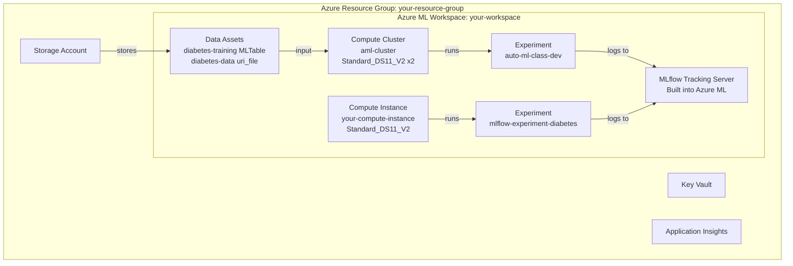

# Lab 01: Find the Best Classification Model with AutoML + MLflow

## Overview

This lab covers two core experimentation techniques in Azure Machine Learning:
1. **Automated Machine Learning (AutoML)** -- let Azure try multiple algorithms automatically to find the best model
2. **MLflow Tracking** -- manually and automatically log model training metrics, parameters, and artifacts

These are foundational skills for the AI-300 exam: understanding how to experiment with models before operationalizing them.

### Architecture Diagram



**Estimated time:** ~30 min (AutoML job runs 15-25 min)
**Azure cost:** ~$1-2 (compute cluster spin-up + a few minutes of training)

## Prerequisites

- Azure subscription with admin access
- Azure CLI installed and authenticated (`az login`)
- Python SDK installed (`azure-ai-ml`, `mlflow`, `azureml-mlflow`)

## What Was Done

### Step 1: Provision Azure ML Infrastructure

- **What:** Created the resource group, workspace, compute instance, compute cluster, and data assets using Azure CLI.

```bash
# Create resource group
az group create --name your-resource-group --location swedencentral

# Create Azure ML workspace (auto-provisions Storage, Key Vault, App Insights)
az ml workspace create --name your-workspace --location swedencentral

# Create compute instance (for interactive work like notebooks)
az ml compute create --name your-compute-instance --size STANDARD_DS11_V2 --type ComputeInstance

# Create compute cluster (for scalable training jobs)
az ml compute create --name aml-cluster --size STANDARD_DS11_V2 --max-instances 2 --type AmlCompute

# Upload data assets
az ml data create --type mltable --name "diabetes-training" --path data/diabetes-data
az ml data create --type uri_file --name "diabetes-data" --path data/diabetes-data/diabetes.csv
```

- **Why:** Azure ML needs a workspace as the central hub. The **compute instance** is like a personal VM for notebooks/scripts. The **compute cluster** auto-scales for training jobs (scales to 0 when idle = no cost). Data assets register datasets so they're versioned and reusable.
- **Result:**
  - Resource group created in your chosen region
  - Workspace provisioned with associated storage, key vault, and App Insights
  - Compute instance running
  - Compute cluster idle (0-2 nodes)
  - Data assets registered: `diabetes-training` (v1, MLTable), `diabetes-data` (v1, uri_file)
- **Exam tip:** Know the difference between compute types:
  - **Compute Instance** = single VM for dev/notebooks (always-on unless stopped)
  - **Compute Cluster** = auto-scaling pool for training jobs (scales to 0)
  - **Serverless Compute** = fully managed, no provisioning needed (newer option)

### Step 2: Submit AutoML Classification Job

- **What:** Submitted an AutoML job to the compute cluster that automatically tries multiple classification algorithms on the diabetes dataset.

```python
from azure.ai.ml import automl, Input
from azure.ai.ml.constants import AssetTypes

# Reference registered data asset
my_training_data_input = Input(type=AssetTypes.MLTABLE, path="azureml:diabetes-training:1")

# Configure AutoML
classification_job = automl.classification(
    compute="aml-cluster",
    experiment_name="auto-ml-class-dev",
    training_data=my_training_data_input,
    target_column_name="Diabetic",
    primary_metric="accuracy",
    n_cross_validations=5,
    enable_model_explainability=True
)

# Control cost with limits
classification_job.set_limits(
    timeout_minutes=60,
    trial_timeout_minutes=20,
    max_trials=5,
    enable_early_termination=True,
)

# Block specific algorithms
classification_job.set_training(
    blocked_training_algorithms=["LogisticRegression"],
    enable_onnx_compatible_models=True
)
```

- **Why:** AutoML automates the tedious process of trying different algorithms and preprocessing pipelines. `max_trials=5` and `timeout_minutes=60` keep costs under control. Blocking `LogisticRegression` forces exploration of tree-based and ensemble methods. `n_cross_validations=5` ensures robust evaluation.
- **Result:** Job submitted to `auto-ml-class-dev` experiment. AutoML tested up to 5 model configurations.
- **Exam tip:** Key AutoML settings to know:
  - `primary_metric` -- what AutoML optimizes for (accuracy, AUC_weighted, etc.)
  - `enable_early_termination` -- stops poorly performing trials early (saves cost)
  - `blocked_training_algorithms` -- exclude specific algorithms
  - `allowed_training_algorithms` -- only allow specific algorithms
  - `n_cross_validations` -- prevents overfitting on small datasets

**What to review in Azure ML Studio:**
1. Go to **Jobs** > `auto-ml-class-dev`
2. Click on the AutoML job
3. Review the **Data guardrails** tab (shows data quality checks)
4. Review the **Models + child jobs** tab (compare algorithms and metrics)

### Step 3: Track Models with MLflow

- **What:** Trained 5 models locally and tracked them with MLflow, using both autologging and custom logging.

| Run | Model | Logging Type | Accuracy |
|-----|-------|-------------|----------|
| 1 | LogisticRegression (C=10) | Autolog | ~0.77 |
| 2 | LogisticRegression (reg_rate=0.1) | Custom | 0.7737 |
| 3 | LogisticRegression (reg_rate=0.01) | Custom | 0.7740 |
| 4 | DecisionTreeClassifier | Custom | 0.8903 |
| 5 | DecisionTreeClassifier + ROC | Custom + Artifact | 0.8860 |

- **Why:** MLflow is the standard for experiment tracking in Azure ML. Understanding the difference between autologging (automatic) and custom logging (manual control) is essential. Autologging captures everything sklearn does automatically. Custom logging lets you choose exactly what to track.

**Key MLflow concepts demonstrated:**

```python
import mlflow

# Autologging -- logs everything automatically
mlflow.sklearn.autolog()
model = LogisticRegression().fit(X_train, y_train)

# Custom logging -- you choose what to log
with mlflow.start_run():
    mlflow.log_param("regularization_rate", 0.1)   # hyperparameters
    mlflow.log_metric("Accuracy", acc)               # evaluation metrics
    mlflow.log_artifact("ROC-Curve.png")             # files (plots, data, etc.)
```

- **Result:** 5 runs logged under `mlflow-experiment-diabetes` experiment, with parameters, metrics, and a ROC curve artifact.
- **Exam tip:** MLflow in Azure ML:
  - **`mlflow.log_param()`** -- log hyperparameters (key-value strings)
  - **`mlflow.log_metric()`** -- log numeric metrics (can be plotted/compared)
  - **`mlflow.log_artifact()`** -- log files (plots, models, data files)
  - **`mlflow.sklearn.autolog()`** -- automatically logs all sklearn metrics
  - Azure ML has a **built-in MLflow tracking server** -- no setup needed on compute instances

**What to review in Azure ML Studio:**
1. Go to **Jobs** > `mlflow-experiment-diabetes`
2. Click on each run to see:
   - **Params** tab -- logged parameters
   - **Metrics** tab -- logged metrics (compare across runs)
   - **Artifacts** tab -- logged files (ROC-Curve.png in Run 5)

## Key Takeaways

1. **AutoML automates model selection** -- you define the data, target, and metric; Azure tries multiple algorithms and picks the best one
2. **MLflow is the experiment tracking standard** -- it works identically in Azure ML and Databricks
3. **Two data asset types matter**: `MLTable` for tabular AutoML input, `uri_file` for file references
4. **Compute clusters scale to zero** -- unlike compute instances, they don't cost money when idle
5. **Always set limits on AutoML** -- `max_trials`, `timeout_minutes`, and `enable_early_termination` prevent runaway costs

## Resources Created

| Resource | Type | Name | Status |
|----------|------|------|--------|
| Resource Group | Microsoft.Resources | your-resource-group | Active |
| ML Workspace | Microsoft.MachineLearningServices | your-workspace | Active |
| Compute Instance | ComputeInstance | your-compute-instance | Running |
| Compute Cluster | AmlCompute | aml-cluster | Idle (0 nodes) |
| Storage Account | Microsoft.Storage | (auto-provisioned) | Active |
| Key Vault | Microsoft.KeyVault | (auto-provisioned) | Active |
| Application Insights | Microsoft.Insights | (auto-provisioned) | Active |
| Data Asset | MLTable | diabetes-training (v1) | Registered |
| Data Asset | uri_file | diabetes-data (v1) | Registered |
| Experiment | AutoML | auto-ml-class-dev | Completed |
| Experiment | MLflow | mlflow-experiment-diabetes | Completed (5 runs) |
