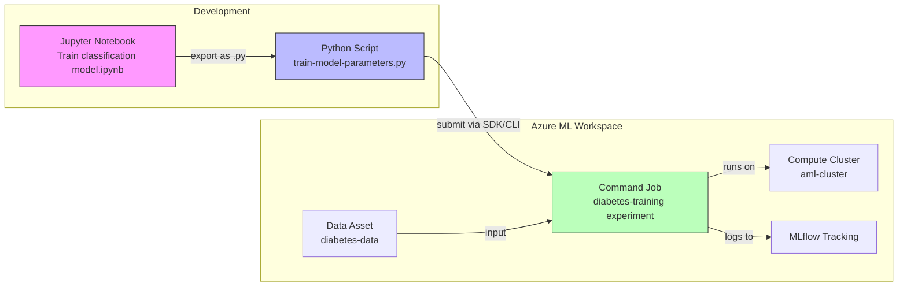

# Lab 02: Optimize Model Training -- Scripts & Command Jobs

## Overview

This lab covers the critical transition from **experimentation** (notebooks) to **production-ready code** (scripts and command jobs). This is the foundation of MLOps -- you can't automate what lives in a notebook.

The progression is: **Notebook -> Python Script -> Command Job -> (later) Pipeline**

### Architecture Diagram



**Estimated time:** ~15 min (jobs run on cluster)
**Azure cost:** ~$0.50 (cluster already provisioned, quick jobs)

## Prerequisites

- Lab 01 infrastructure (workspace, cluster, data assets)

## What Was Done

### Step 1: Understand the Notebook-to-Script Progression

- **What:** Reviewed the `Train classification model.ipynb` notebook, which contains inline code for reading data, splitting, training, and evaluating a logistic regression model.
- **Why:** Notebooks are great for exploration but bad for production:
  - Can't be parameterized easily
  - Can't be versioned cleanly
  - Can't be scheduled or automated
  - Hidden state issues (cells run out of order)
- **Exam tip:** The AI-300 exam expects you to understand WHY notebooks need to be converted to scripts for MLOps.

### Step 2: Review the Production Training Script

- **What:** Examined `src/train-model-parameters.py` -- a parameterized Python script with:
  - `argparse` for CLI arguments (`--training_data`, `--reg_rate`)
  - Modular functions: `get_data()`, `split_data()`, `train_model()`, `eval_model()`
  - MLflow logging integrated directly

```python
# Key pattern: parameterized training script
def main(args):
    df = get_data(args.training_data)           # read data
    X_train, X_test, y_train, y_test = split_data(df)  # split
    model = train_model(args.reg_rate, X_train, X_test, y_train, y_test)  # train
    eval_model(model, X_test, y_test)           # evaluate + log metrics

# MLflow logging inside functions
def train_model(reg_rate, X_train, X_test, y_train, y_test):
    mlflow.log_param("Regularization rate", reg_rate)
    model = LogisticRegression(C=1/reg_rate, solver="liblinear").fit(X_train, y_train)
    return model

def eval_model(model, X_test, y_test):
    acc = np.average(model.predict(X_test) == y_test)
    mlflow.log_metric("Accuracy", acc)
    auc = roc_auc_score(y_test, model.predict_proba(X_test)[:,1])
    mlflow.log_metric("AUC", auc)
```

- **Why:** This structure is production-ready because:
  - **Parameterized** -- can change data path and hyperparameters without editing code
  - **Modular** -- each function does one thing, easy to test and modify
  - **Tracked** -- MLflow logs ensure reproducibility
- **Exam tip:** Know the key `argparse` pattern. The `--training_data` argument is how Azure ML passes data asset paths to scripts at runtime.

### Step 3: Run Script Locally (Testing)

- **What:** You can test the script locally before submitting as a job:

```bash
python train-model-parameters.py --training_data ../data/diabetes-data/diabetes.csv
```

- **Why:** Always test scripts locally first. Debugging on a remote cluster is slow and expensive.

### Step 4: Submit as Command Job (via Python SDK)

- **What:** Submitted 3 command jobs to the `diabetes-training` experiment:

```python
from azure.ai.ml import command, Input

job = command(
    code="../src",                    # folder with your script
    command="python train-model-parameters.py --training_data ${{inputs.training_data}}",
    inputs={
        "training_data": Input(type="uri_folder", path="../data/diabetes-data"),
    },
    environment="AzureML-sklearn-1.0-ubuntu20.04-py38-cpu@latest",
    compute="aml-cluster",
    display_name="diabetes-train-script",
    experiment_name="diabetes-training"
)
returned_job = ml_client.create_or_update(job)
```

| Job | Display Name | Purpose |
|-----|-------------|---------|
| (shown in output) | diabetes-train-script | Basic command job with custom MLflow logging |
| (shown in output) | diabetes-train-mlflow | Same script with autolog enabled |
| (shown in output) | diabetes-train-command | YAML-equivalent job definition |

- **Why:** Command jobs are the bridge between scripts and automation:
  - **Reproducible** -- exact environment, inputs, and compute are recorded
  - **Scalable** -- runs on cluster, not your laptop
  - **Trackable** -- shows up in Azure ML Studio with full history
- **Exam tip:** Key command job parameters:
  - `code` -- path to the script folder (uploaded to Azure)
  - `command` -- the exact CLI command to run
  - `inputs` -- data inputs using `${{inputs.name}}` syntax
  - `environment` -- curated or custom Docker environment
  - `compute` -- which compute target to use

### Step 5: Submit via YAML Definition (CLI approach)

- **What:** The equivalent CLI command using a YAML file:

```yaml
# src/job.yml
$schema: https://azuremlschemas.azureedge.net/latest/commandJob.schema.json
code: .
command: >-
  python train-model-parameters.py
  --training_data ${{inputs.training_data}}
  --reg_rate ${{inputs.reg_rate}}
inputs:
  training_data:
    type: uri_folder
    path: azureml:diabetes-data@latest
  reg_rate: 0.01
environment: azureml:AzureML-sklearn-1.0-ubuntu20.04-py38-cpu@latest
compute: azureml:aml-cluster
experiment_name: diabetes-training
```

```bash
az ml job create -f src/job.yml --stream
```

- **Why:** YAML definitions are preferred for CI/CD pipelines (GitHub Actions) because they're declarative and version-controllable.
- **Exam tip:** The `--stream` flag tails the job logs in real-time. Without it, the command returns immediately after submission.

**What to review in Azure ML Studio:**
1. Go to **Jobs** > `diabetes-training` experiment
2. Click on each job to see:
   - **Code** tab -- the uploaded script
   - **Outputs + logs** tab -- stdout/stderr logs (`std_log.txt`)
   - **Metrics** tab -- MLflow-logged accuracy and AUC
   - **Images** tab -- ROC curve artifact

## Key Takeaways

1. **Notebooks -> Scripts -> Jobs** is the core MLOps progression
2. **Parameterize everything** -- use `argparse` for data paths and hyperparameters so the same script works with different inputs
3. **Two ways to submit jobs**: Python SDK (`command()`) or CLI (`az ml job create -f job.yml`)
4. **YAML definitions are CI/CD-friendly** -- they're what GitHub Actions workflows reference
5. **`${{inputs.name}}`** is the placeholder syntax for data inputs in both SDK and YAML
6. **Curated environments** (`AzureML-sklearn-1.0-ubuntu20.04-py38-cpu@latest`) save you from building custom Docker images

## Resources Created

| Resource | Type | Name | Status |
|----------|------|------|--------|
| Job | Command | diabetes-train-script | Completed |
| Job | Command | diabetes-train-mlflow | Completed |
| Job | Command | diabetes-train-command | Completed |
| Experiment | Grouping | diabetes-training | Active (3 runs) |
