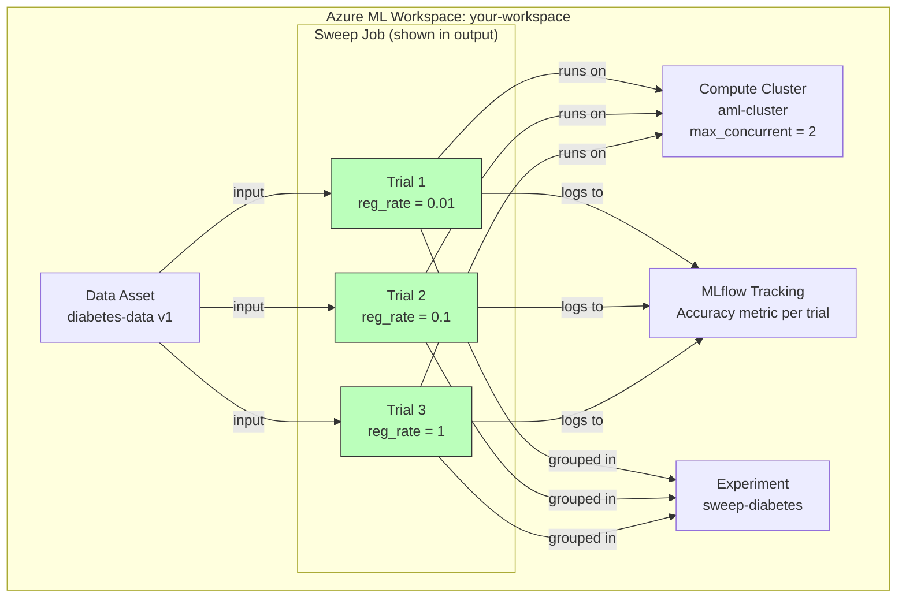

# Lab 03: Perform Hyperparameter Tuning with a Sweep Job

## Overview

This lab covers **hyperparameter tuning** using Azure ML **sweep jobs**. Instead of manually trying different hyperparameter values (like we did in Lab 02 with a single `--reg_rate`), a sweep job automatically runs multiple trials across a defined search space and picks the best one.

This is the natural progression: **Script -> Command Job -> Sweep Job** (automated tuning of that same script).

### Architecture Diagram



**Estimated time:** ~20 min (baseline job + sweep trials on cluster)
**Azure cost:** ~$1 (3 trials on aml-cluster)

## Prerequisites

- Lab 01 infrastructure (workspace, cluster, data asset `diabetes-data`)
- Lab 02 training script (`train-model-parameters.py` with `--reg_rate` argument)

## What Was Done

### Step 1: Understand Hyperparameters

- **What:** Hyperparameters are settings that control the training process but are NOT learned from the data. They must be set before training begins. For logistic regression, `reg_rate` (regularization rate) controls how much the model penalizes large coefficients to prevent overfitting.

  | Concept | Description |
  |---------|-------------|
  | **Hyperparameter** | A value set before training (e.g., learning rate, regularization rate, tree depth) |
  | **Parameter** | A value learned during training (e.g., model weights, coefficients) |
  | **Tuning** | The process of finding the best hyperparameter values |

- **Why:** Choosing the wrong hyperparameter can mean the difference between a mediocre model and a great one. Manual tuning is slow and doesn't scale. Sweep jobs automate this search.
- **Exam tip:** Know the difference between hyperparameters and model parameters. The exam tests this distinction. Hyperparameters are set by the data scientist; model parameters are learned by the algorithm from training data.

### Step 2: Create the Training Script

- **What:** We reuse the same `train-model-parameters.py` script from Lab 02. The key requirement for sweep jobs is that the script must:
  1. Accept the hyperparameter as a CLI argument (`--reg_rate`)
  2. Log the metric that the sweep job will optimize (`Accuracy`)

```python
# train-model-parameters.py (same script from Lab 02)
def train_model(reg_rate, X_train, X_test, y_train, y_test):
    mlflow.log_param("Regularization rate", reg_rate)
    model = LogisticRegression(C=1/reg_rate, solver="liblinear").fit(X_train, y_train)
    return model

def eval_model(model, X_test, y_test):
    y_hat = model.predict(X_test)
    acc = np.average(y_hat == y_test)
    mlflow.log_metric("Accuracy", acc)      # <-- sweep job reads this metric
    auc = roc_auc_score(y_test, y_scores[:,1])
    mlflow.log_metric("AUC", auc)
```

- **Why:** The sweep job doesn't modify your script. It simply runs it multiple times with different `--reg_rate` values. The script must log the target metric so the sweep job knows which trial performed best.
- **Exam tip:** The `primary_metric` name in the sweep config must **exactly match** the metric name logged by `mlflow.log_metric()`. If your script logs `"Accuracy"` but you set `primary_metric="accuracy"`, the sweep job will fail to find the metric.

### Step 3: Run Baseline Command Job

- **What:** Before configuring the sweep, first run a single command job with a fixed `reg_rate=0.01` to verify the script works correctly on the cluster.

```python
from azure.ai.ml import command, Input
from azure.ai.ml.constants import AssetTypes

job = command(
    code="../../mslearn-mlops/src",
    command="python train-model-parameters.py "
            "--training_data ${{inputs.diabetes_data}} "
            "--reg_rate ${{inputs.reg_rate}}",
    inputs={
        "diabetes_data": Input(type=AssetTypes.URI_FILE, path="azureml:diabetes-data:1"),
        "reg_rate": 0.01,
    },
    environment="AzureML-sklearn-1.0-ubuntu20.04-py38-cpu@latest",
    compute="aml-cluster",
    display_name="diabetes-train-baseline",
    experiment_name="diabetes-training",
    tags={"model_type": "LogisticRegression"}
)
returned_job = ml_client.create_or_update(job)
```

- **Why:** Always test the script with a single run before sweeping. If the script fails, it's much faster to debug one job than to wait for a sweep of broken trials. This is the same pattern from Lab 02 -- the only new thing is what comes next.
- **Exam tip:** Notice the `tags` parameter -- tags are key-value metadata you can add to any job. They're searchable in Azure ML Studio and useful for organizing experiments.

### Step 4: Define the Search Space

- **What:** The search space defines which hyperparameter values to try. We use `Choice` to specify an explicit list of `reg_rate` values.

```python
from azure.ai.ml.sweep import Choice

# Start from the baseline command job and replace reg_rate with a search space
command_job_for_sweep = job(
    reg_rate=Choice(values=[0.01, 0.1, 1]),
)
```

- **Why:** `Choice` creates a discrete search space -- the sweep will try exactly these three values. This is the simplest search space type and pairs naturally with grid sampling (try every combination).

  **Azure ML search space types:**

  | Type | Syntax | Use Case |
  |------|--------|----------|
  | `Choice` | `Choice(values=[0.01, 0.1, 1])` | Discrete set of values |
  | `Uniform` | `Uniform(min_value=0.01, max_value=1.0)` | Continuous uniform distribution |
  | `LogUniform` | `LogUniform(min_value=-3, max_value=0)` | Log-scale continuous (good for learning rates) |
  | `Normal` | `Normal(mu=0, sigma=1)` | Normal distribution |
  | `QUniform` | `QUniform(min_value=1, max_value=10, q=1)` | Quantized uniform (integer values) |

- **Exam tip:** `Choice` only works with **grid sampling**. `Uniform`, `LogUniform`, and `Normal` require **random** or **bayesian** sampling because they define continuous distributions. The exam will test which search space types are compatible with which sampling algorithms.

### Step 5: Configure and Submit Sweep Job

- **What:** Configure the sweep job with the sampling algorithm, optimization goal, and resource limits, then submit it.

```python
sweep_job = command_job_for_sweep.sweep(
    compute="aml-cluster",
    sampling_algorithm="grid",        # Try every combination
    primary_metric="Accuracy",        # Must match mlflow.log_metric() name
    goal="Maximize",                  # We want highest accuracy
)

sweep_job.experiment_name = "sweep-diabetes"
sweep_job.set_limits(
    max_total_trials=4,               # Safety cap on total trials
    max_concurrent_trials=2,          # Run 2 trials in parallel
    timeout=7200,                     # 2-hour timeout for entire sweep
)

returned_sweep_job = ml_client.create_or_update(sweep_job)
```

- **Result:** Sweep job submitted to `sweep-diabetes` experiment. Grid sampling produced 3 trials (one for each `reg_rate` value).

- **Why:** The configuration breaks down as:
  - **`sampling_algorithm="grid"`** -- exhaustive search, tries every value in the search space. Guarantees you won't miss anything but doesn't scale to large spaces.
  - **`primary_metric` + `goal`** -- tells the sweep which metric to optimize and whether to maximize or minimize it.
  - **`set_limits()`** -- prevents runaway costs. `max_total_trials` caps the number of runs; `max_concurrent_trials` controls parallelism (limited by cluster node count); `timeout` is a hard wall clock limit.

  **Sampling algorithm comparison:**

  | Algorithm | How It Works | When to Use | Supports Early Termination? |
  |-----------|-------------|-------------|---------------------------|
  | **Grid** | Tries every combination | Small, discrete search spaces | No (tries all anyway) |
  | **Random** | Random samples from distributions | Large search spaces, initial exploration | Yes |
  | **Bayesian** | Uses past results to pick next trial | Expensive models, want to converge fast | No |

- **Exam tip:** Grid sampling with `Choice` is the most predictable -- with 3 values, you get exactly 3 trials. Random sampling is better for large continuous search spaces. Bayesian sampling is the smartest but cannot run trials in parallel (each trial depends on previous results). The exam often asks "which sampling algorithm should you use if..." scenarios.

**What to review in Azure ML Studio:**
1. Go to **Jobs** > `sweep-diabetes` experiment
2. Click on the sweep job
3. Review the **Trials** tab:
   - See all 3 trials with their `reg_rate` values and `Accuracy` results
   - The best trial is highlighted
4. Review the **Child jobs** tab:
   - Click into any child job to see its full MLflow logs, metrics, and artifacts
5. Check the **Metrics** chart:
   - Visualize how `Accuracy` varies across `reg_rate` values

## Key Takeaways

1. **Sweep jobs automate hyperparameter search** -- they run the same script multiple times with different hyperparameter values and pick the best one
2. **Search space types matter** -- `Choice` for discrete values, `Uniform`/`LogUniform` for continuous ranges, and they must be compatible with the sampling algorithm
3. **Three sampling algorithms** -- Grid (exhaustive, small spaces), Random (large spaces, supports early termination), Bayesian (smart but sequential)
4. **`primary_metric` must match exactly** -- the metric name in `sweep()` must match the name passed to `mlflow.log_metric()` in your training script
5. **Always set limits** -- `max_total_trials`, `max_concurrent_trials`, and `timeout` prevent cost overruns, especially with random/bayesian sampling that could run indefinitely

## Resources Created

| Resource | Type | Name | Status |
|----------|------|------|--------|
| Job | Command | diabetes-train-baseline | Completed |
| Job | Sweep | (shown in output) | Completed (3 trials) |
| Experiment | Grouping | sweep-diabetes | Active |
| Child Job | Trial 1 | reg_rate=0.01 | Completed |
| Child Job | Trial 2 | reg_rate=0.1 | Completed |
| Child Job | Trial 3 | reg_rate=1 | Completed |
