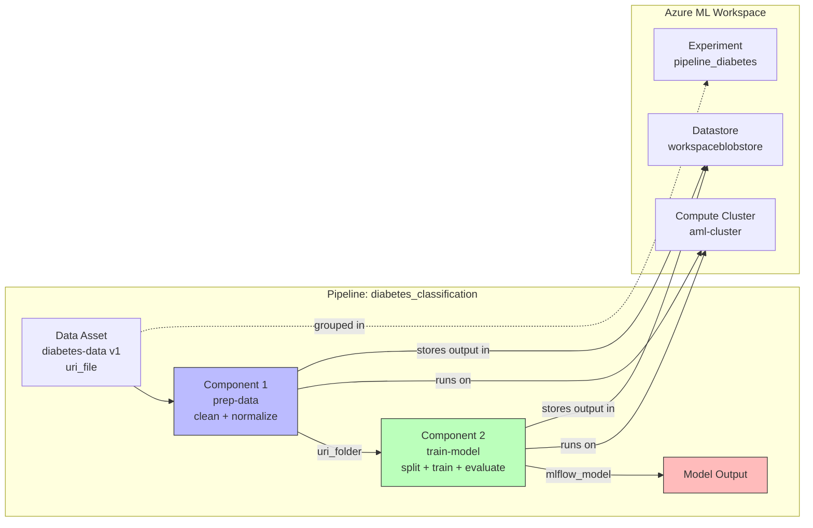

# Lab 04: Run Pipelines in Azure Machine Learning

## Overview

This lab covers **Azure ML pipelines** -- the mechanism for chaining multiple steps (components) into a reproducible, automated workflow. Instead of running a single training script, we break the workflow into reusable components: one for data preparation and one for model training.

This is the natural progression: **Script -> Command Job -> Sweep Job -> Pipeline** (multi-step automation).

### Architecture Diagram



**Estimated time:** ~20 min (both components run sequentially on cluster)
**Azure cost:** ~$1 (two short jobs on aml-cluster)

## Prerequisites

- Lab 01 infrastructure (workspace, cluster, data asset `diabetes-data`)
- Understanding of command jobs from Lab 02

## What Was Done

### Step 1: Understand Pipeline Architecture

- **What:** An Azure ML pipeline is a workflow composed of **components**. Each component is a self-contained step with defined inputs, outputs, and code. Components connect through data dependencies -- the output of one becomes the input of the next.

  | Concept | Description |
  |---------|-------------|
  | **Pipeline** | A DAG (Directed Acyclic Graph) of connected components |
  | **Component** | A reusable, self-contained step (script + interface definition) |
  | **Input** | Data or parameters flowing into a component |
  | **Output** | Data or models produced by a component |
  | **Data dependency** | Component B runs after Component A because B needs A's output |

- **Why:** Pipelines solve critical problems with single-script approaches:
  - **Separation of concerns** -- data prep logic is isolated from training logic
  - **Reusability** -- the same `prep-data` component can be reused in different pipelines
  - **Selective re-execution** -- if only the training code changes, the data prep step can be cached
  - **Team collaboration** -- a data engineer writes `prep-data`, an ML engineer writes `train-model`

- **Exam tip:** Azure ML pipelines are fundamentally different from scikit-learn Pipelines. Azure ML pipelines orchestrate multiple **compute jobs**. Scikit-learn pipelines chain **data transformations** within a single job. The exam tests this distinction.

### Step 2: Create Component Scripts

- **What:** Two Python scripts, each handling one stage of the workflow.

**`src/prep-data.py`** -- reads raw data, cleans it, normalizes numeric features, writes the result to an output folder:

```python
import argparse
import pandas as pd
import numpy as np
from pathlib import Path
from sklearn.preprocessing import MinMaxScaler

def main(args):
    df = get_data(args.input_data)
    cleaned_data = clean_data(df)
    normalized_data = normalize_data(cleaned_data)
    normalized_data.to_csv((Path(args.output_data) / "diabetes.csv"), index=False)

def get_data(path):
    df = pd.read_csv(path)
    print(f"Preparing {len(df)} rows of data")
    return df

def clean_data(df):
    return df.dropna()

def normalize_data(df):
    scaler = MinMaxScaler()
    num_cols = ["Pregnancies","PlasmaGlucose","DiastolicBloodPressure",
                "TricepsThickness","SerumInsulin","BMI","DiabetesPedigree"]
    df[num_cols] = scaler.fit_transform(df[num_cols])
    return df
```

**`src/train-model.py`** -- reads the prepped data, splits it, trains a logistic regression model, evaluates it, and saves the model in MLflow format:

```python
import mlflow
import glob
import argparse
import pandas as pd
import numpy as np
from sklearn.model_selection import train_test_split
from sklearn.linear_model import LogisticRegression
from sklearn.metrics import roc_auc_score, roc_curve

def main(args):
    mlflow.autolog()
    df = get_data(args.training_data)
    X_train, X_test, y_train, y_test = split_data(df)
    model = train_model(args.reg_rate, X_train, X_test, y_train, y_test)
    eval_model(model, X_test, y_test)
    mlflow.sklearn.save_model(model, args.model_output)  # <-- saves as mlflow_model
```

- **Why:** Each script has a clear, single responsibility. `prep-data.py` knows nothing about model training; `train-model.py` knows nothing about data cleaning. This makes each component independently testable, versionable, and reusable.
- **Exam tip:** Notice the data flow pattern:
  - `prep-data.py` writes to `args.output_data` (a **folder** path -- `uri_folder`)
  - `train-model.py` reads from `args.training_data` (also a **folder** path -- it uses `glob` to find CSVs)
  - `train-model.py` writes to `args.model_output` using `mlflow.sklearn.save_model()` (an **`mlflow_model`** output type)

### Step 3: Define Components in YAML

- **What:** Each component needs a YAML definition that describes its interface (inputs, outputs, code, environment, command). These YAML files are the **contract** between the component and the pipeline.

**`prep-data.yml`:**

```yaml
$schema: https://azuremlschemas.azureedge.net/latest/commandComponent.schema.json
name: prep_data
display_name: Prepare training data
version: 1
type: command
inputs:
  input_data:
    type: uri_file
outputs:
  output_data:
    type: uri_folder
code: ./src
environment: azureml:AzureML-sklearn-1.0-ubuntu20.04-py38-cpu@latest
command: >-
  python prep-data.py
  --input_data ${{inputs.input_data}}
  --output_data ${{outputs.output_data}}
```

**`train-model.yml`:**

```yaml
$schema: https://azuremlschemas.azureedge.net/latest/commandComponent.schema.json
name: train_model
display_name: Train a logistic regression model
version: 1
type: command
inputs:
  training_data:
    type: uri_folder
  reg_rate:
    type: number
    default: 0.01
outputs:
  model_output:
    type: mlflow_model
code: ./src
environment: azureml:AzureML-sklearn-1.0-ubuntu20.04-py38-cpu@latest
command: >-
  python train-model.py
  --training_data ${{inputs.training_data}}
  --reg_rate ${{inputs.reg_rate}}
  --model_output ${{outputs.model_output}}
```

- **Why:** The YAML definitions decouple the component interface from the pipeline that uses it. You can version components independently, share them across teams, and register them in an Azure ML registry for cross-workspace reuse (this becomes critical in Lab 05).

  **Key YAML fields explained:**

  | Field | Purpose |
  |-------|---------|
  | `$schema` | Tells Azure ML this is a `commandComponent` (not a `pipelineComponent` or `sparkComponent`) |
  | `inputs` / `outputs` | Define the typed interface -- what data goes in/out |
  | `type: uri_file` | A single file (the raw CSV) |
  | `type: uri_folder` | A folder of files (prepped data output) |
  | `type: mlflow_model` | An MLflow-formatted model directory |
  | `type: number` | A numeric parameter (not data) |
  | `code` | Path to the script folder (uploaded to Azure) |
  | `command` | The CLI command with `${{inputs.name}}` / `${{outputs.name}}` placeholders |

- **Exam tip:** The output type of one component must match the input type of the next. `prep-data` outputs `uri_folder`, so `train-model` must accept `uri_folder` as its `training_data` input. Type mismatches cause pipeline validation errors before the job even starts.

### Step 4: Build the Pipeline with @pipeline Decorator

- **What:** The `@pipeline` decorator from `azure.ai.ml.dsl` turns a Python function into a pipeline definition. Inside the function, you instantiate components and wire their inputs/outputs together.

```python
from azure.ai.ml import Input, load_component
from azure.ai.ml.dsl import pipeline

# Load component definitions from YAML
prep_data = load_component(source="prep-data.yml")
train_logistic_regression = load_component(source="train-model.yml")

@pipeline()
def diabetes_classification(pipeline_job_input):
    # Step 1: clean and normalize data
    clean_data = prep_data(input_data=pipeline_job_input)

    # Step 2: train model on prepped data (wired via clean_data.outputs.output_data)
    train_model = train_logistic_regression(training_data=clean_data.outputs.output_data)

    # Expose outputs at pipeline level
    return {
        "pipeline_job_transformed_data": clean_data.outputs.output_data,
        "pipeline_job_trained_model": train_model.outputs.model_output,
    }
```

- **Why:** The `@pipeline` decorator is syntactic sugar that builds the DAG automatically. When you write `training_data=clean_data.outputs.output_data`, Azure ML infers that `train_model` depends on `clean_data` and must run after it. The `return` dictionary defines which intermediate outputs are surfaced as pipeline-level outputs (accessible after the pipeline finishes).

- **Exam tip:** The `@pipeline` decorator is the **Python SDK approach**. You can also define pipelines entirely in YAML. The exam may show either syntax and ask you to identify how components are connected. The key pattern is: `component_b(input=component_a.outputs.output_name)`.

### Step 5: Configure and Submit Pipeline Job

- **What:** Instantiate the pipeline function with the actual data input, configure compute/datastore/output modes, and submit.

```python
from azure.ai.ml.constants import AssetTypes

# Create pipeline instance with actual data
pipeline_job = diabetes_classification(
    Input(type=AssetTypes.URI_FILE, path="azureml:diabetes-data:1")
)

# Configure pipeline settings
pipeline_job.outputs.pipeline_job_transformed_data.mode = "upload"
pipeline_job.outputs.pipeline_job_trained_model.mode = "upload"
pipeline_job.settings.default_compute = "aml-cluster"
pipeline_job.settings.default_datastore = "workspaceblobstore"

# Submit to Azure ML
pipeline_job = ml_client.jobs.create_or_update(
    pipeline_job, experiment_name="pipeline_diabetes"
)
```

- **Result:** Pipeline job submitted to `pipeline_diabetes` experiment. The pipeline ran two steps sequentially: `prep-data` then `train-model`.

- **Why:** The configuration controls important behavior:

  | Setting | Value | Purpose |
  |---------|-------|---------|
  | `outputs.mode = "upload"` | Upload to datastore | Makes outputs accessible after the job completes (vs. `"mount"` which is read-only during job) |
  | `default_compute` | `aml-cluster` | All components run on this cluster unless overridden |
  | `default_datastore` | `workspaceblobstore` | Intermediate data stored here between components |

  **Output mode comparison:**

  | Mode | Behavior | When to Use |
  |------|----------|-------------|
  | `upload` | Copies output to datastore after step completes | Default for pipeline outputs you want to keep |
  | `mount` | Data is mounted read-only to compute | Large datasets, read-only access |
  | `download` | Downloads to compute local disk | Small datasets, fast local access |
  | `rw_mount` | Read-write mount | When script needs to modify existing data in-place |

- **Exam tip:** `default_compute` applies to all components that don't specify their own compute. In production pipelines, you might run data prep on a CPU cluster and model training on a GPU cluster by setting `compute` per-component. The exam may ask about this pattern.

**What to review in Azure ML Studio:**
1. Go to **Jobs** > `pipeline_diabetes` experiment
2. Click on the pipeline job
3. Review the **Pipeline visualization graph**:
   - See the two components connected as boxes with arrows
   - Each box shows its status (Completed/Running/Failed)
   - Click on a box to see that component's inputs, outputs, logs, and metrics
4. Click on `prep_data` component:
   - **Outputs** tab -- see the `uri_folder` containing the cleaned `diabetes.csv`
5. Click on `train_model` component:
   - **Metrics** tab -- see MLflow-logged Accuracy, AUC, and autolog metrics
   - **Outputs** tab -- see the `mlflow_model` directory with model artifacts

## Key Takeaways

1. **Pipelines chain components into reproducible workflows** -- each component is a self-contained step with typed inputs and outputs, connected through data dependencies
2. **YAML defines the component interface** -- the `commandComponent` schema declares inputs, outputs, code, environment, and command; this is the contract between a component and any pipeline that uses it
3. **The `@pipeline` decorator builds the DAG** -- wire components together with `component_b(input=component_a.outputs.output_name)` and Azure ML infers the execution order
4. **Output types determine data flow** -- `uri_folder` for intermediate data between components, `mlflow_model` for trained models that can be registered and deployed
5. **Components are reusable** -- the same `prep-data` component can be used in a training pipeline, a batch scoring pipeline, or shared across teams via an Azure ML registry

## Resources Created

| Resource | Type | Name | Status |
|----------|------|------|--------|
| Job | Pipeline | (shown in output) | Completed |
| Component | Step 1 | prep_data | Completed |
| Component | Step 2 | train_model | Completed |
| Experiment | Grouping | pipeline_diabetes | Active |
| Output | uri_folder | pipeline_job_transformed_data | Uploaded to workspaceblobstore |
| Output | mlflow_model | pipeline_job_trained_model | Uploaded to workspaceblobstore |
| YAML | Component Def | prep-data.yml | Created |
| YAML | Component Def | train-model.yml | Created |
