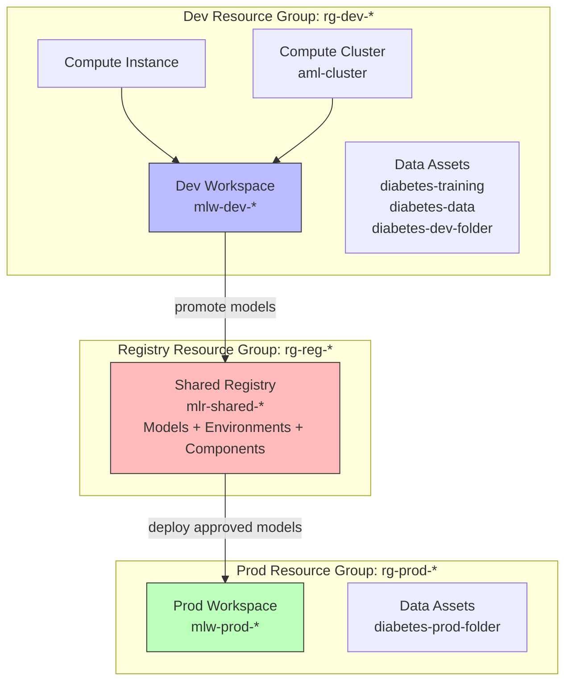

# Lab 05: Plan and Prepare an MLOps Solution

## Overview

This is a **design lab**, not a training lab. Instead of training models, we design the **infrastructure architecture** for a production MLOps solution: separate dev and prod workspaces, a shared model registry, environment-specific data assets, and parameterized provisioning scripts.

This lab answers: "How do you move from experimenting in a single workspace to running ML in production with proper separation of concerns?"

### Architecture Diagram



**Estimated time:** ~30 min (reading and understanding; provisioning optional)
**Azure cost:** ~$3-5 if you run the full script (creates 3 resource groups, 2 workspaces, 1 registry)

## Prerequisites

- Lab 01 infrastructure understanding (how workspaces, compute, and data assets are created)
- Azure CLI installed and authenticated (`az login`)
- `az ml` extension installed (`az extension add -n ml`)

## What Was Done

### Step 1: Review the Setup Script

- **What:** The `setup.sh` script from Lab 01 provisions a single workspace with compute and data assets. Understanding this script is the baseline -- Lab 05 extends it to handle multiple environments.

```bash
# setup.sh -- single-environment provisioning (Lab 01 baseline)
guid=$(cat /proc/sys/kernel/random/uuid)
suffix=${guid//[-]/}
suffix=${suffix:0:18}

RESOURCE_GROUP="rg-${suffix}"
WORKSPACE_NAME="mlw-${suffix}"
COMPUTE_INSTANCE="ci${suffix}"
COMPUTE_CLUSTER="aml-cluster"

# Create resource group
az group create --name $RESOURCE_GROUP --location $RANDOM_REGION

# Create workspace (auto-provisions Storage, Key Vault, App Insights)
az ml workspace create --name $WORKSPACE_NAME

# Set CLI defaults so subsequent commands don't need --resource-group and --workspace-name
az configure --defaults group=$RESOURCE_GROUP workspace=$WORKSPACE_NAME

# Create compute
az ml compute create --name $COMPUTE_INSTANCE --size STANDARD_DS11_V2 --type ComputeInstance
az ml compute create --name $COMPUTE_CLUSTER --size STANDARD_DS11_V2 --max-instances 2 --type AmlCompute

# Create data assets
az ml data create --type mltable --name "diabetes-training" --path ../data/diabetes-data
az ml data create --type uri_file --name "diabetes-data" --path ../data/diabetes-data/diabetes.csv
```

- **Why:** This script works for experimentation but has critical gaps for production:
  - Single workspace = no environment separation (dev experiments mixed with production)
  - No shared registry = can't promote validated models across workspaces
  - Hardcoded values = can't parameterize for different environments
  - No prod workspace = nowhere to deploy models for real traffic

- **Exam tip:** `az configure --defaults` sets CLI defaults for the current session. This means you don't need to pass `--resource-group` and `--workspace-name` on every subsequent command. The exam may test this shortcut and when it applies.

### Step 2: Design Dev/Prod Environment Architecture

- **What:** Production MLOps requires at minimum three Azure components:

  | Component | Purpose | Why Separate? |
  |-----------|---------|---------------|
  | **Dev Workspace** | Experimentation, training, hyperparameter tuning | Data scientists can experiment freely without affecting production |
  | **Prod Workspace** | Model deployment, inference endpoints, monitoring | Strict access control, production SLAs, different data |
  | **Shared Registry** | Cross-workspace model/environment/component sharing | Approved models promoted from dev are deployed in prod from the same registry |

  The dev workspace gets compute instances (for notebooks) and compute clusters (for training jobs). The prod workspace typically only needs inference compute (managed endpoints). The shared registry has no compute -- it's a catalog of approved assets.

- **Why:** Environment separation is a core MLOps principle (similar to dev/staging/prod in software engineering):
  - **Access control** -- data scientists have Contributor on dev, Reader on prod; ML engineers have Contributor on both
  - **Data isolation** -- dev uses sampled/anonymized data; prod uses real data
  - **Cost tracking** -- separate resource groups = separate cost centers
  - **Compliance** -- prod can have stricter networking, encryption, and audit policies
  - **Blast radius** -- a broken experiment in dev can't take down production inference

- **Exam tip:** The AI-300 exam frequently tests the dev/prod workspace separation pattern. Know that the **shared registry** is the bridge -- you don't copy models between workspaces; you register them in a shared registry and reference them from both. This is conceptually similar to a container registry in traditional DevOps.

### Step 3: Plan Registry Creation

- **What:** An Azure ML registry is a cross-workspace catalog for sharing models, environments, components, and datasets. It's defined in YAML and created with the Azure CLI.

**`registry.yml`** (template with placeholders):

```yaml
name: REGISTRY_NAME_PLACEHOLDER
tags:
  description: Shared registry for approved machine learning assets across workspaces
location: PRIMARY_REGION_PLACEHOLDER
replication_locations:
  - location: PRIMARY_REGION_PLACEHOLDER
```

**Provisioning commands:**

```bash
# Replace placeholders with actual values using sed
sed \
    -e "s|REGISTRY_NAME_PLACEHOLDER|$REGISTRY_NAME|g" \
    -e "s|PRIMARY_REGION_PLACEHOLDER|$RANDOM_REGION|g" \
    registry.yml > registry.generated.yml

# Create the registry from the rendered YAML
az ml registry create \
    --file registry.generated.yml \
    --resource-group $REGISTRY_RESOURCE_GROUP
```

- **Why:** The `sed` + template pattern is a lightweight form of infrastructure-as-code. The YAML template is version-controlled in Git; environment-specific values are injected at provisioning time. This is the same pattern used in CI/CD pipelines (GitHub Actions will do this in Lab 06).

  **What you can store in a registry:**

  | Asset Type | CLI Command | Purpose |
  |-----------|-------------|---------|
  | Models | `az ml model create --registry-name` | Share trained models across workspaces |
  | Environments | `az ml environment create --registry-name` | Consistent runtime environments |
  | Components | `az ml component create --registry-name` | Reusable pipeline components |
  | Data | `az ml data create --registry-name` | Shared reference datasets |

- **Exam tip:** The `replication_locations` field enables geo-redundancy -- the registry is replicated to multiple Azure regions for high availability. For the exam, know that registries are separate from workspaces and exist at the subscription level, not inside a workspace.

### Step 4: Plan Production Workspace

- **What:** The production workspace lives in its own resource group with its own data assets. It has no compute instance (no interactive development in prod) and initially no compute cluster (inference endpoints will be created in Lab 07).

```bash
# Create prod resource group
az group create --name $PROD_RESOURCE_GROUP --location $RANDOM_REGION

# Create prod workspace
az ml workspace create \
    --name $PROD_WORKSPACE_NAME \
    --resource-group $PROD_RESOURCE_GROUP

# Set CLI defaults to prod
az configure --defaults group=$PROD_RESOURCE_GROUP workspace=$PROD_WORKSPACE_NAME

# Create prod-specific data asset
az ml data create \
    --type uri_folder \
    --name "diabetes-prod-folder" \
    --path ../production/data
```

- **Why:** The prod workspace is intentionally minimal:
  - No compute instance = no one can SSH in and run ad-hoc notebooks
  - Separate data assets = prod uses real data, not dev samples
  - Own resource group = separate RBAC, cost tracking, and networking policies

- **Exam tip:** Know the difference between `az ml workspace create` (creates a workspace) and `az ml registry create` (creates a registry). Workspaces are environment-specific; registries are shared across environments. The exam tests whether you can identify which command provisions which resource.

### Step 5: Plan Environment-Specific Data Assets

- **What:** Dev and prod environments use different data assets with different data, even though the schema is the same.

```bash
# Dev data assets (in dev workspace)
az ml data create --type mltable --name "diabetes-training" --path ../data/diabetes-data
az ml data create --type uri_file --name "diabetes-data" --path ../data/diabetes-data/diabetes.csv
az ml data create --type uri_folder --name "diabetes-dev-folder" --path ../data/diabetes-data

# Prod data asset (in prod workspace)
az ml data create --type uri_folder --name "diabetes-prod-folder" --path ../production/data
```

- **Why:** Data separation is critical for several reasons:
  - **Privacy** -- dev uses synthetic/sampled data; prod uses real patient data
  - **Scale** -- dev data may be small for fast iteration; prod data is full-scale
  - **Schema validation** -- same column names and types, but different rows
  - **Compliance** -- production data may have stricter access policies (e.g., HIPAA)

  **Data asset types review:**

  | Type | CLI Flag | Description | Use Case |
  |------|----------|-------------|----------|
  | `uri_file` | `--type uri_file` | Single file reference | One CSV, one parquet file |
  | `uri_folder` | `--type uri_folder` | Folder reference | Multiple files, model artifacts |
  | `mltable` | `--type mltable` | Tabular data with schema | AutoML input, structured data |

- **Exam tip:** Data assets are versioned automatically. When you create a data asset with the same name in the same workspace, it gets a new version (v1, v2, v3...). Your pipelines can reference `azureml:diabetes-data:1` (specific version) or `azureml:diabetes-data@latest` (always latest). The exam tests version pinning vs. latest.

### Step 6: Parameterize the Script

- **What:** The full `setup-mlops-envs.sh` script provisions all three environments in one run: dev workspace, prod workspace, and shared registry. It uses shell variables and a random suffix to generate unique resource names.

```bash
#!/bin/bash
# setup-mlops-envs.sh -- full MLOps environment provisioning

# Generate unique suffix
guid=$(cat /proc/sys/kernel/random/uuid)
suffix=${guid//[-]/}
suffix=${suffix:0:18}

# Environment-specific names
DEV_RESOURCE_GROUP="rg-dev-${suffix}"
DEV_WORKSPACE_NAME="mlw-dev-${suffix}"
PROD_RESOURCE_GROUP="rg-prod-${suffix}"
PROD_WORKSPACE_NAME="mlw-prod-${suffix}"
REGISTRY_RESOURCE_GROUP="rg-reg-${suffix}"
REGISTRY_NAME="mlr-shared-${suffix}"

# Dev environment
az group create --name $DEV_RESOURCE_GROUP --location $RANDOM_REGION
az ml workspace create --name $DEV_WORKSPACE_NAME --resource-group $DEV_RESOURCE_GROUP
az configure --defaults group=$DEV_RESOURCE_GROUP workspace=$DEV_WORKSPACE_NAME
az ml compute create --name $COMPUTE_INSTANCE --size STANDARD_DS11_V2 --type ComputeInstance
az ml compute create --name $COMPUTE_CLUSTER --size STANDARD_DS11_V2 --max-instances 2 --type AmlCompute
az ml data create --type uri_folder --name "diabetes-dev-folder" --path ../data/diabetes-data

# Prod environment
az group create --name $PROD_RESOURCE_GROUP --location $RANDOM_REGION
az ml workspace create --name $PROD_WORKSPACE_NAME --resource-group $PROD_RESOURCE_GROUP
az configure --defaults group=$PROD_RESOURCE_GROUP workspace=$PROD_WORKSPACE_NAME
az ml data create --type uri_folder --name "diabetes-prod-folder" --path ../production/data

# Shared registry
az group create --name $REGISTRY_RESOURCE_GROUP --location $RANDOM_REGION
sed -e "s|REGISTRY_NAME_PLACEHOLDER|$REGISTRY_NAME|g" \
    -e "s|PRIMARY_REGION_PLACEHOLDER|$RANDOM_REGION|g" \
    registry.yml > registry.generated.yml
az ml registry create --file registry.generated.yml --resource-group $REGISTRY_RESOURCE_GROUP
```

- **Why:** Parameterization makes the script:
  - **Idempotent** -- the random suffix means each run creates fresh resources (no name collisions)
  - **Reproducible** -- the same script provisions identical environments every time
  - **CI/CD-ready** -- GitHub Actions can run this script in a workflow (Lab 06)
  - **Auditable** -- the script IS the documentation of what was provisioned

  **Key CLI commands used in this lab:**

  | Command | Purpose |
  |---------|---------|
  | `az group create` | Create a resource group |
  | `az ml workspace create` | Create an Azure ML workspace |
  | `az ml compute create` | Create compute (instance or cluster) |
  | `az ml data create` | Register a data asset |
  | `az ml registry create` | Create a shared ML registry |
  | `az configure --defaults` | Set CLI defaults (avoid repeating `--resource-group`) |
  | `sed -e 's\|old\|new\|g'` | Template substitution in YAML files |

- **Exam tip:** The exam heavily tests `az ml` CLI commands. Know the pattern: `az ml <resource-type> <action>`. Common resource types: `workspace`, `compute`, `data`, `model`, `environment`, `component`, `registry`, `job`. Common actions: `create`, `list`, `show`, `delete`, `update`. You don't need to memorize every flag, but know which resource type goes with which action.

**What to review in Azure ML Studio:**
1. If you ran the script, navigate to [ml.azure.com](https://ml.azure.com)
2. Use the workspace switcher (top-left dropdown) to switch between dev and prod workspaces
3. In the dev workspace: verify compute, data assets, and experiments from Labs 01-04
4. In the prod workspace: verify only the prod data asset exists (no compute, no experiments)
5. Go to [ml.azure.com/registries](https://ml.azure.com/registries) to see the shared registry (initially empty -- models are promoted here after validation)

## Key Takeaways

1. **Dev/prod workspace separation** is the foundation of MLOps -- experimentation happens in dev, deployment happens in prod, and the shared registry bridges them
2. **Azure ML registries** enable cross-workspace sharing of models, environments, and components -- they are the promotion mechanism for ML assets (similar to a container registry in DevOps)
3. **`az ml` CLI is the infrastructure-as-code tool** for Azure ML -- know the `az ml <resource-type> <action>` pattern and the key resource types (workspace, compute, data, registry, model, environment)
4. **Parameterized scripts** with unique suffixes make provisioning reproducible and collision-free -- this is the pattern GitHub Actions uses in CI/CD
5. **Infrastructure-as-code** means the provisioning script IS the documentation -- version it in Git, review it in PRs, and run it in CI/CD pipelines

## Resources Created

| Resource | Type | Name | Status |
|----------|------|------|--------|
| Resource Group | Dev | rg-dev-* | Planned (created if script is run) |
| Resource Group | Prod | rg-prod-* | Planned |
| Resource Group | Registry | rg-reg-* | Planned |
| Workspace | Dev | mlw-dev-* | Planned |
| Workspace | Prod | mlw-prod-* | Planned |
| Registry | Shared | mlr-shared-* | Planned |
| Compute Instance | Dev only | ci* | Planned |
| Compute Cluster | Dev only | aml-cluster | Planned |
| Data Asset | Dev | diabetes-dev-folder | Planned |
| Data Asset | Prod | diabetes-prod-folder | Planned |
| YAML Template | Registry | registry.yml | Created |
| Script | Provisioning | setup-mlops-envs.sh | Created |

*Note: This lab is design-focused. The asterisk (*) names depend on the random suffix generated at runtime. Resources are planned -- run `setup-mlops-envs.sh` to actually provision them.*
