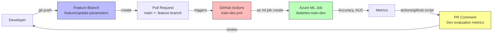

# Lab 06: Automate Model Training with GitHub Actions

## Overview

This lab covers **CI/CD for machine learning** using GitHub Actions. Instead of manually running `az ml job create` from a terminal, we configure GitHub workflows that automatically trigger Azure ML training jobs when code changes are pushed, pull requests are opened, or a workflow is manually dispatched.

This is the natural progression from Lab 05: **Plan infrastructure -> Automate training -> Automate deployment** (Lab 07).

### Architecture Diagram



**Estimated time:** ~25 min
**Azure cost:** ~$1 (short training jobs on aml-cluster)

## Prerequisites

- Lab 05 infrastructure (resource group with workspace, aml-cluster, data assets)
- Azure CLI authenticated (`az login`)
- GitHub account with repository created from template
- Service principal with Contributor role on the subscription/resource group

## What Was Done

### Step 1: Create GitHub Repository from Template

- **What:** The Microsoft Learn template repository (`MicrosoftLearning/mslearn-mlops`) provides starter code for MLOps workflows. Create a personal copy using GitHub's "Use this template" feature.

  | Action | Details |
  |--------|---------|
  | Template repo | `MicrosoftLearning/mslearn-mlops` |
  | Your repo | `your-username/mslearn-mlops` |
  | Method | "Use this template" -> "Create a new repository" |
  | Visibility | Public (required for free GitHub Actions minutes) |

- **Why:** "Use this template" creates a **new repository** with a clean commit history (unlike forking, which keeps the upstream history and fork relationship). This is the standard pattern for lab repositories -- you get the starter files without the baggage of someone else's commit history.

- **Result:** A new repo with the starter `src/` directory, `job.yml`, and training scripts.

- **Exam tip:** The exam distinguishes between **forking** (maintains link to upstream, used for open-source contributions) and **using a template** (creates independent copy, used for starting new projects). For MLOps, templates are preferred because your CI/CD pipelines should not depend on an upstream repository.

### Step 2: Create a Service Principal

- **What:** A service principal is an Azure AD identity for automated processes. GitHub Actions uses this identity to authenticate with Azure and run `az ml` commands without a human login.

```bash
az ad sp create-for-rbac \
    --name "your-service-principal-name" \
    --role contributor \
    --scopes /subscriptions/<subscription-id>/resourceGroups/your-resource-group \
    --sdk-auth
```

  **Output (JSON credentials):**

```json
{
  "clientId": "xxxxxxxx-xxxx-xxxx-xxxx-xxxxxxxxxxxx",
  "clientSecret": "xxxxxxxxxxxxxxxxxxxxxxxxxxxxxxxxxx",
  "subscriptionId": "xxxxxxxx-xxxx-xxxx-xxxx-xxxxxxxxxxxx",
  "tenantId": "xxxxxxxx-xxxx-xxxx-xxxx-xxxxxxxxxxxx",
  "activeDirectoryEndpointUrl": "https://login.microsoftonline.com",
  "resourceManagerEndpointUrl": "https://management.azure.com/",
  ...
}
```

  **Flags explained:**

  | Flag | Purpose |
  |------|---------|
  | `--name` | Display name for the service principal in Azure AD |
  | `--role contributor` | Grants Contributor access (can create/manage resources, but not manage access) |
  | `--scopes` | Limits access to a specific resource group (least privilege) |
  | `--sdk-auth` | Outputs JSON in the format required by `azure/login@v2` GitHub Action |

- **Why:** GitHub Actions runs in a Microsoft-hosted Ubuntu runner -- it has no access to your Azure subscription by default. The service principal provides:
  - **Non-interactive authentication** -- no human login prompt in CI/CD
  - **Scoped access** -- Contributor on the specific resource group, not the entire subscription
  - **Auditable identity** -- all actions are logged under the service principal's name
  - **Rotatable credentials** -- the client secret can be rotated without affecting other users

- **Result:** Service principal created with Contributor role on your resource group.

- **Exam tip:** The exam tests the principle of **least privilege**. Using `--scopes` with a specific resource group (not the full subscription) limits the blast radius. If the service principal credentials are compromised, the attacker can only affect that one resource group. Know that `--role contributor` allows creating resources but does NOT allow modifying role assignments (that requires the Owner role).

### Step 3: Configure GitHub Secrets and Variables

- **What:** GitHub secrets store sensitive credentials (encrypted, never displayed in logs). GitHub variables store non-sensitive configuration values. Both are accessible in workflow YAML files.

  | Type | Name | Value | Scope |
  |------|------|-------|-------|
  | **Secret** | `AZURE_CREDENTIALS` | Full JSON output from `az ad sp create-for-rbac --sdk-auth` | Repository or Environment |
  | **Variable** | `AZURE_RESOURCE_GROUP` | `your-resource-group` | Repository or Environment |
  | **Variable** | `AZURE_WORKSPACE_NAME` | `your-workspace` | Repository or Environment |

  **How to configure:**
  1. Go to repo -> Settings -> Secrets and variables -> Actions
  2. Under "Secrets" tab: New repository secret -> `AZURE_CREDENTIALS` -> paste JSON
  3. Under "Variables" tab: New repository variable -> `AZURE_RESOURCE_GROUP` -> your resource group name
  4. Under "Variables" tab: New repository variable -> `AZURE_WORKSPACE_NAME` -> your workspace name

  **How they're referenced in workflow YAML:**

```yaml
# Secrets: ${{ secrets.SECRET_NAME }}
creds: ${{ secrets.AZURE_CREDENTIALS }}

# Variables: ${{ vars.VARIABLE_NAME }}
--resource-group ${{ vars.AZURE_RESOURCE_GROUP }}
--workspace-name ${{ vars.AZURE_WORKSPACE_NAME }}
```

- **Why:** Separating secrets from variables follows security best practices:
  - **Secrets** are encrypted at rest, masked in logs, and cannot be read back once set
  - **Variables** are plaintext and visible -- appropriate for non-sensitive config like resource group names
  - Both can be scoped to **environments** (dev, prod) for multi-environment workflows (covered in Lab 07)

- **Result:** GitHub repository configured with `AZURE_CREDENTIALS` secret and resource group/workspace variables.

- **Exam tip:** The exam tests the difference between **repository secrets** (available to all workflows) and **environment secrets** (only available to workflows that specify `environment: <name>`). Environment secrets enable per-environment credentials -- for example, dev and prod service principals with different access scopes.

### Step 4: Review Network Settings

- **What:** Azure ML workspaces can be configured with different network access levels. For GitHub Actions to submit jobs, the workspace must be accessible from the public internet (since GitHub runners run on Microsoft-hosted infrastructure).

  | Setting | Value for this lab | Description |
  |---------|-------------------|-------------|
  | Public network access | Enabled | Allows connections from any IP |
  | Workspace endpoint | Public endpoint | No VNet/private endpoint required |

  **To verify in Azure portal:**
  1. Navigate to your Azure ML workspace resource
  2. Go to Settings -> Networking
  3. Confirm "Public network access" is set to "Enabled"

- **Why:** In production, workspaces are often locked behind private endpoints and VNets. This requires **self-hosted GitHub runners** inside the same VNet -- a more complex setup. For this lab, public access keeps things simple. The trade-off is security vs. accessibility.

  | Scenario | Network Config | GitHub Runner |
  |----------|---------------|---------------|
  | Lab/Dev | Public endpoint | GitHub-hosted runner |
  | Enterprise | Private endpoint + VNet | Self-hosted runner in VNet |

- **Result:** Workspace network access verified as public -- GitHub-hosted runners can reach the Azure ML API.

- **Exam tip:** The exam tests private endpoint scenarios. If a question describes a workspace behind a private endpoint and asks why GitHub Actions fails, the answer is that GitHub-hosted runners cannot reach private endpoints. The fix is either a self-hosted runner or an Azure DevOps agent inside the VNet.

### Step 5: Configure the Manual-Trigger Workflow

- **What:** The first workflow (`manual-trigger-job.yml`) is the simplest pattern: a `workflow_dispatch` trigger that runs an Azure ML training job on demand.

```yaml
name: Manually trigger an Azure Machine Learning job

on:
  workflow_dispatch:

jobs:
  train:
    runs-on: ubuntu-latest
    steps:
    - name: Check out repo
      uses: actions/checkout@main
    - name: Install az ml extension
      run: az extension add -n ml -y
    - name: Azure login
      uses: azure/login@v2
      with:
        creds: ${{secrets.AZURE_CREDENTIALS}}
    - name: Run Azure Machine Learning training job
      run: az ml job create -f src/job.yml --stream
        --resource-group ${{ vars.AZURE_RESOURCE_GROUP }}
        --workspace-name ${{ vars.AZURE_WORKSPACE_NAME }}
```

  **Workflow YAML structure explained:**

  | Section | Purpose |
  |---------|---------|
  | `name:` | Display name in the Actions tab |
  | `on: workflow_dispatch` | Trigger type -- manual button click |
  | `jobs:` | One or more jobs that run in parallel (or sequentially with `needs:`) |
  | `runs-on: ubuntu-latest` | Runner environment (Microsoft-hosted Ubuntu VM) |
  | `steps:` | Sequential steps within a job |
  | `uses:` | Reference to a reusable GitHub Action (e.g., `actions/checkout`) |
  | `run:` | Shell command to execute |

  **Key steps explained:**

  | Step | What it does |
  |------|-------------|
  | `actions/checkout@main` | Clones your repo into the runner so `src/job.yml` is available |
  | `az extension add -n ml -y` | Installs the Azure ML CLI extension (not pre-installed on runners) |
  | `azure/login@v2` | Authenticates using the service principal credentials from secrets |
  | `az ml job create -f src/job.yml --stream` | Submits the training job and streams logs to the workflow output |

- **Why:** The manual trigger is the simplest entry point to GitHub Actions + Azure ML:
  - No branch or PR triggers -- just a button click
  - Validates that authentication, CLI extension, and job submission all work
  - The `--stream` flag blocks the workflow until the job completes, so you see results inline

- **Result:** Workflow file `.github/workflows/manual-trigger-job.yml` configured and committed.

- **Exam tip:** `workflow_dispatch` is the only trigger type that adds a "Run workflow" button in the GitHub Actions UI. The exam may describe a scenario where a data scientist wants to manually retrain a model and ask which trigger to use -- the answer is `workflow_dispatch`.

### Step 6: Test the Manual Trigger

- **What:** Run the manual-trigger workflow from the GitHub Actions UI and verify the job appears in Azure ML Studio.

  **Steps:**
  1. Go to your repo -> Actions tab
  2. Select "Manually trigger an Azure Machine Learning job" in the left sidebar
  3. Click "Run workflow" -> select `main` branch -> "Run workflow"
  4. Watch the workflow logs -- the `az ml job create --stream` step shows training output in real-time
  5. Navigate to [ml.azure.com](https://ml.azure.com) -> Jobs -> `diabetes-training` experiment -> verify the job completed

  **What to look for in the workflow logs:**

```
Training model...
Accuracy: 0.774
AUC: 0.848
```

- **Why:** This step validates the entire authentication and execution chain:
  - GitHub secret -> service principal -> Azure login -> CLI extension -> job creation -> compute cluster -> training script
  - If any link fails, the workflow fails with a clear error message

- **Result:** Azure ML training job submitted and completed via GitHub Actions. Job visible in Azure ML Studio under the `diabetes-training` experiment.

- **Exam tip:** When a GitHub Actions workflow fails, the error is shown in the workflow logs (not in Azure ML Studio). Common failures include: expired service principal credentials, missing CLI extension, workspace not found (wrong resource group/workspace name), and compute cluster not running. Know where to look for each type of error.

### Step 7: Add PR-Based Trigger

- **What:** The `train-dev.yml` workflow adds an automated trigger: when a pull request is opened (or updated) that modifies the training code, the workflow runs automatically.

```yaml
name: Train model in dev

on:
  workflow_dispatch:
  pull_request:
    branches:
      - main
    paths:
      - 'src/train-model-parameters.py'
      - 'src/job.yml'

permissions:
  contents: read
  pull-requests: write

jobs:
  train-dev:
    runs-on: ubuntu-latest
    environment: dev
    steps:
      # ... (checkout, login, install CLI, detect workspace)

      - name: Run training job in dev and capture logs
        id: train
        run: |
          JOB_NAME="diabetes-train-dev-${{ github.run_id }}"
          az ml job create \
            -f src/job.yml \
            --name "$JOB_NAME" \
            --set inputs.training_data.path=azureml:diabetes-dev-folder@latest \
            --stream | tee training_output.log

      - name: Extract dev metrics from logs
        id: parse-metrics
        run: |
          ACC=$(grep -o "Accuracy: .*" training_output.log | tail -n 1 | awk '{print $2}')
          AUC=$(grep -o "AUC: .*" training_output.log | tail -n 1 | awk '{print $2}')
          echo "dev_accuracy=$ACC" >> "$GITHUB_OUTPUT"
          echo "dev_auc=$AUC" >> "$GITHUB_OUTPUT"

      - name: Comment dev metrics on pull request
        if: github.event_name == 'pull_request'
        uses: actions/github-script@v7
        with:
          script: |
            const acc = '${{ steps.parse-metrics.outputs.dev_accuracy }}';
            const auc = '${{ steps.parse-metrics.outputs.dev_auc }}';
            const prNumber = context.payload.pull_request.number;
            let body = 'Dev training workflow completed.\n\n**Dev evaluation metrics**';
            if (acc) body += `\n- Accuracy: ${acc}`;
            if (auc) body += `\n- AUC: ${auc}`;
            await github.rest.issues.createComment({
              owner: context.repo.owner,
              repo: context.repo.repo,
              issue_number: prNumber,
              body,
            });
```

  **Key differences from the manual-trigger workflow:**

  | Feature | manual-trigger-job.yml | train-dev.yml |
  |---------|----------------------|---------------|
  | Trigger | `workflow_dispatch` only | `workflow_dispatch` + `pull_request` |
  | Path filter | None | Only `src/` files |
  | Environment | None | `dev` |
  | Metrics | Logs only | Parsed and posted as PR comment |
  | Job naming | Default | Includes `github.run_id` for traceability |
  | Data asset | Default from `job.yml` | Overridden to `diabetes-dev-folder@latest` |

  **New concepts:**

  | Concept | Syntax | Purpose |
  |---------|--------|---------|
  | Path filter | `paths: ['src/*.py']` | Only triggers when matching files change |
  | `GITHUB_OUTPUT` | `echo "key=value" >> "$GITHUB_OUTPUT"` | Pass data between steps |
  | `tee` | `command \| tee file.log` | Write output to both stdout and a file |
  | `actions/github-script` | `uses: actions/github-script@v7` | Run JavaScript to interact with GitHub API |
  | `environment:` | `environment: dev` | Uses environment-specific secrets/variables |
  | `permissions:` | `pull-requests: write` | Grants the workflow token permission to comment on PRs |

- **Why:** PR-based triggers are the foundation of ML CI/CD:
  - **Automatic validation** -- every code change is tested before merging
  - **Path filters** prevent unnecessary runs -- changing the README doesn't retrain the model
  - **Metrics as PR comments** give reviewers immediate feedback without opening Azure ML Studio
  - **Environment scoping** ensures dev training uses dev credentials and dev data

- **Result:** The `train-dev.yml` workflow triggers automatically on PRs that modify training code and posts metrics as a PR comment.

- **Exam tip:** The `pull_request` trigger runs on the **merge commit** (not the branch tip). GitHub creates a temporary merge of the PR branch into the target branch and runs the workflow on that. This ensures the workflow tests the code as it will look after merging. The exam may test this subtlety.

### Step 8: Set Up Branch Protection

- **What:** Branch protection rules prevent direct pushes to `main`, requiring all changes to go through a pull request. This ensures the CI/CD workflow always runs before code reaches production.

  **Configuration:**
  1. Go to repo -> Settings -> Branches -> "Add branch protection rule"
  2. Branch name pattern: `main`
  3. Enable: "Require a pull request before merging"
  4. Enable: "Require status checks to pass before merging" (select the `train-dev` job)
  5. Disable: "Allow force pushes" and "Allow deletions"

  | Rule | Effect |
  |------|--------|
  | Require PR | No direct `git push` to `main` |
  | Require status checks | PR cannot be merged until `train-dev` workflow passes |
  | No force pushes | Cannot overwrite `main` history |

- **Why:** Branch protection enforces the development workflow:
  - Every change to training code must be reviewed (PR) and validated (workflow)
  - A broken training script cannot reach `main`
  - The CI/CD pipeline acts as an automated gatekeeper

- **Result:** Direct pushes to `main` are blocked. All changes must go through a PR with a passing `train-dev` workflow.

- **Exam tip:** Branch protection + required status checks is the MLOps mechanism for **model validation before promotion**. The exam may describe a scenario where untested model code reaches production and ask how to prevent it -- the answer is branch protection with required CI checks.

### Step 9: Feature Branch Development Cycle

- **What:** The end-to-end development cycle: create a feature branch, make a code change, push, create a PR, and observe the automated workflow.

```bash
# 1. Create and switch to a feature branch
git checkout -b feature/update-parameters

# 2. Modify the regularization rate in job.yml
# Change reg_rate from 0.01 to 0.1

# 3. Stage and commit the change
git add src/job.yml
git commit -m "Update regularization rate from 0.01 to 0.1"

# 4. Push the feature branch to GitHub
git push origin feature/update-parameters

# 5. Create a pull request on GitHub
# Title: "Update regularization rate parameter"
# Base: main <- Compare: feature/update-parameters
```

  **What happens automatically:**
  1. PR is created: `feature/update-parameters -> main`
  2. GitHub detects that `src/job.yml` was modified (matches the path filter)
  3. `train-dev.yml` workflow triggers automatically
  4. Workflow submits an Azure ML job with the new `reg_rate=0.1`
  5. Job trains on `diabetes-dev-folder` data
  6. Metrics are extracted from logs and posted as a PR comment
  7. Reviewer sees metrics directly in the PR conversation

  **PR comment posted by the workflow:**

  > Dev training workflow completed.
  >
  > **Dev evaluation metrics**
  > - Accuracy: 0.774
  > - AUC: 0.848

- **Why:** This is the core MLOps feedback loop:
  - Developer changes a hyperparameter -> CI retrains -> metrics are visible in the PR
  - The reviewer can compare metrics before and after the change
  - No need to manually run experiments or check Azure ML Studio
  - The PR becomes the single source of truth for what changed and what the impact was

- **Result:** PR created. The `train-dev` workflow triggered automatically, trained the model, and posted dev metrics as a PR comment.

- **Exam tip:** The exam tests the concept of **feature branching** in MLOps. The key insight is that feature branches in ML are not just about code changes -- they represent **experiments**. Each PR is an experiment proposal, the CI workflow is the experiment execution, and the PR comment is the experiment report. This maps directly to the Git-based experiment tracking pattern.

## Key Takeaways

1. **GitHub Actions automates the ML training loop** -- code changes trigger training jobs, and metrics are posted back to the PR. This replaces the manual "modify script -> run job -> check Studio" cycle with a fully automated CI pipeline.

2. **Service principals provide non-interactive Azure authentication** -- the `az ad sp create-for-rbac --sdk-auth` command creates a JSON credential that GitHub Actions uses to authenticate. Scope it to a specific resource group (least privilege) and store it as a GitHub secret (never in code).

3. **GitHub environments enable per-environment configuration** -- the `environment: dev` field in a workflow scopes secrets and variables to a specific environment. This allows dev and prod to use different service principals, workspaces, and data assets from the same workflow file.

4. **Feature branching + branch protection enforces ML code review** -- no training code reaches `main` without passing through a PR with automated validation. This is the MLOps equivalent of code review + unit tests in software engineering.

5. **Workflow triggers control when automation runs** -- `workflow_dispatch` (manual), `pull_request` (on PR), `push` (on commit), and `issue_comment` (on PR comment) cover the full spectrum of ML CI/CD triggers. Path filters prevent unnecessary retraining when non-code files change.

## Resources Created

| Resource | Type | Name | Status |
|----------|------|------|--------|
| GitHub Repo | Repository | your-username/mslearn-mlops | Created from template |
| Service Principal | Azure AD | your-service-principal-name | Created with Contributor role |
| GitHub Secret | AZURE_CREDENTIALS | (encrypted) | Configured |
| GitHub Variable | AZURE_RESOURCE_GROUP | your-resource-group | Configured |
| GitHub Variable | AZURE_WORKSPACE_NAME | your-workspace | Configured |
| Workflow | Manual trigger | .github/workflows/manual-trigger-job.yml | Configured |
| Workflow | Dev training | .github/workflows/train-dev.yml | Configured |
| Branch | Feature branch | feature/update-parameters | Created |
| Pull Request | PR | Update regularization rate parameter | Created, dev workflow triggered |
