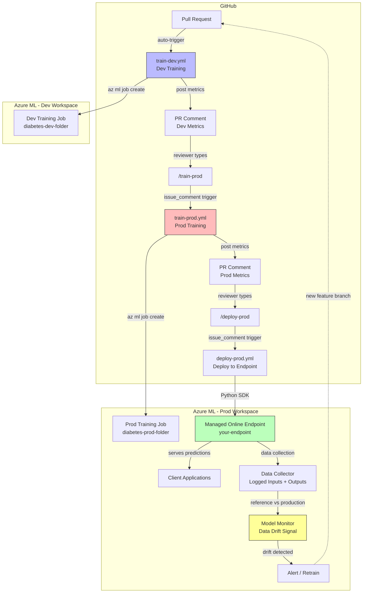

# Lab 07: Deploy and Monitor a Model

## Overview

This lab covers the **full MLOps lifecycle** -- from dev training through production deployment, endpoint monitoring, and drift-triggered retraining. Building on Lab 06's GitHub Actions foundation, we add production training (`/train-prod`), managed endpoint deployment (`/deploy-prod`), data collection, model monitoring, and the complete retrain cycle.

This is the final MLOps lab: **Plan -> Automate training -> Deploy and monitor** (full loop).

### Architecture Diagram



**Estimated time:** ~45 min (endpoint provisioning takes ~8-10 min)
**Azure cost:** ~$5-10 (managed online endpoint incurs per-hour compute charges while running; delete the endpoint when done)

## Prerequisites

- Lab 06 completed (GitHub repo configured with workflows, service principal, secrets, PR open)
- Lab 05 infrastructure (dev and prod resource groups with respective workspaces)
- Data assets: `diabetes-dev-folder` (dev workspace), `diabetes-prod-folder` (prod workspace)
- GitHub environments: `dev` and `prod` configured with appropriate secrets

## What Was Done

### Step 1: Configure GitHub Environments

- **What:** GitHub environments provide per-environment secrets, variables, and optional approval gates. Configure two environments (`dev` and `prod`) with separate credentials so that dev workflows authenticate against the dev workspace and prod workflows authenticate against the prod workspace.

  **Configuration in GitHub:**
  1. Go to repo -> Settings -> Environments
  2. Create environment: `dev`
     - Add secret: `AZURE_CREDENTIALS` (service principal JSON with access to dev resource group)
  3. Create environment: `prod`
     - Add secret: `AZURE_CREDENTIALS` (service principal JSON with access to prod resource group)
     - (Optional) Add required reviewers for manual approval before prod jobs run

  | Environment | Secret | Resource Group | Workspace | Approval Gate |
  |------------|--------|----------------|-----------|---------------|
  | `dev` | `AZURE_CREDENTIALS` | your-dev-resource-group | your-dev-workspace | None |
  | `prod` | `AZURE_CREDENTIALS` | your-prod-resource-group | your-prod-workspace | Optional |

  **How environments are referenced in workflow YAML:**

```yaml
jobs:
  train-dev:
    runs-on: ubuntu-latest
    environment: dev    # <-- uses dev secrets
    steps:
      - uses: azure/login@v2
        with:
          creds: ${{ secrets.AZURE_CREDENTIALS }}  # resolves to dev credentials
```

- **Why:** Environment separation prevents accidental cross-environment access:
  - A dev workflow cannot accidentally deploy to the prod workspace
  - Prod approval gates add a human checkpoint before production changes
  - Each environment can use a different service principal with appropriately scoped permissions
  - Environment protection rules create an audit trail of who approved what

- **Result:** GitHub environments `dev` and `prod` configured with environment-scoped `AZURE_CREDENTIALS` secrets.

- **Exam tip:** The exam tests **environment protection rules**. Know that required reviewers create a manual approval step -- the workflow pauses and waits for a designated reviewer to approve before proceeding. This is the MLOps equivalent of a deployment gate. Also know that environment secrets override repository-level secrets of the same name.

### Step 2: Configure the Train-Dev Workflow with PR Trigger

- **What:** The `train-dev.yml` workflow (configured in Lab 06) automatically trains in the dev workspace when a PR modifies training code. It uses path filters to avoid unnecessary runs and posts metrics as a PR comment.

```yaml
name: Train model in dev

on:
  workflow_dispatch:
  pull_request:
    branches:
      - main
    paths:
      - 'src/train-model-parameters.py'
      - 'src/job.yml'

permissions:
  contents: read
  pull-requests: write

jobs:
  train-dev:
    runs-on: ubuntu-latest
    environment: dev
    steps:
      - name: Check out repository
        uses: actions/checkout@v4

      - name: Sign in to Azure
        uses: azure/login@v2
        with:
          creds: ${{ secrets.AZURE_CREDENTIALS }}

      - name: Install Azure ML CLI
        run: az extension add -n ml -y

      - name: Detect Azure ML workspace
        id: detect
        run: |
          RG_NAME=$(az group list \
            --query "[?starts_with(name,'your-rg-prefix')].name | [0]" -o tsv)
          WS_NAME=$(az ml workspace list --resource-group "$RG_NAME" \
            --query "[?starts_with(name,'your-ws-prefix')].name | [0]" -o tsv)
          az configure --defaults group="$RG_NAME" workspace="$WS_NAME"
          echo "resource_group=$RG_NAME" >> "$GITHUB_OUTPUT"
          echo "workspace=$WS_NAME" >> "$GITHUB_OUTPUT"

      - name: Run training job in dev and capture logs
        run: |
          JOB_NAME="diabetes-train-dev-${{ github.run_id }}"
          az ml job create \
            -f src/job.yml \
            --name "$JOB_NAME" \
            --set inputs.training_data.path=azureml:diabetes-dev-folder@latest \
            --stream | tee training_output.log

      - name: Extract dev metrics from logs
        id: parse-metrics
        run: |
          ACC=$(grep -o "Accuracy: .*" training_output.log | tail -n 1 | awk '{print $2}')
          AUC=$(grep -o "AUC: .*" training_output.log | tail -n 1 | awk '{print $2}')
          echo "dev_accuracy=$ACC" >> "$GITHUB_OUTPUT"
          echo "dev_auc=$AUC" >> "$GITHUB_OUTPUT"

      - name: Comment dev metrics on pull request
        if: github.event_name == 'pull_request'
        uses: actions/github-script@v7
        with:
          script: |
            const acc = '${{ steps.parse-metrics.outputs.dev_accuracy }}';
            const auc = '${{ steps.parse-metrics.outputs.dev_auc }}';
            const prNumber = context.payload.pull_request.number;
            let body = 'Dev training workflow completed.\n\n**Dev evaluation metrics**';
            if (acc) body += `\n- Accuracy: ${acc}`;
            if (auc) body += `\n- AUC: ${auc}`;
            await github.rest.issues.createComment({
              owner: context.repo.owner,
              repo: context.repo.repo,
              issue_number: prNumber,
              body,
            });
```

  **Key patterns in this workflow:**

  | Pattern | Implementation | Purpose |
  |---------|---------------|---------|
  | Auto-detection | `az group list --query "[?starts_with(...)]"` | Finds workspace without hardcoding names |
  | Job naming | `diabetes-train-dev-${{ github.run_id }}` | Unique job name per workflow run for traceability |
  | Data override | `--set inputs.training_data.path=azureml:diabetes-dev-folder@latest` | Uses dev data, not the default in `job.yml` |
  | Log capture | `\| tee training_output.log` | Saves output for metric extraction while still streaming to console |
  | Step outputs | `>> "$GITHUB_OUTPUT"` | Passes parsed metrics between steps |
  | Conditional step | `if: github.event_name == 'pull_request'` | Only comments on PRs, not manual dispatches |

- **Why:** The dev workflow is the first validation gate: it ensures the model trains successfully with dev data and the metrics are reasonable before anyone considers running in production.

- **Result:** Workflow configured; triggers automatically on PR creation or update when `src/` files are modified.

- **Exam tip:** The `--set` flag in `az ml job create` overrides values in the job YAML at submission time. This is a critical pattern for environment promotion -- the same `job.yml` is used in both dev and prod, but the data asset path is overridden per environment. The exam tests this override mechanism.

### Step 3: Create a Feature Branch and Trigger Dev Training

- **What:** Create a feature branch with a code change to trigger the automated dev training workflow.

```bash
# Create a feature branch
git checkout -b feature/update-parameters

# Edit src/job.yml -- change reg_rate from 0.01 to 0.1

# Commit and push
git add src/job.yml
git commit -m "Update regularization rate from 0.01 to 0.1"
git push origin feature/update-parameters

# Create PR on GitHub:
# Title: "Update regularization rate parameter"
# Base: main <- Compare: feature/update-parameters
```

- **Why:** The feature branch isolates the experiment. The PR serves as the experiment proposal, and the automated workflow serves as the experiment execution. All experiments are tracked in Git with a clear audit trail.

- **Result:** PR created. The `train-dev` workflow triggered automatically because `src/job.yml` was modified.

- **Exam tip:** In MLOps, a pull request is not just a code review request -- it is an **experiment proposal**. The CI workflow is the experiment execution, the PR comment is the experiment report, and the merge decision is the experiment approval. This maps directly to the scientific method: hypothesis (branch) -> experiment (workflow) -> analysis (metrics) -> decision (merge/close).

### Step 4: Review Dev Metrics Posted as PR Comment

- **What:** After the `train-dev` workflow completes, it posts a comment on the PR with the dev training metrics.

  **Example PR comment:**

  > Dev training workflow completed.
  >
  > **Dev evaluation metrics**
  > - Accuracy: 0.774
  > - AUC: 0.848

  **What to check:**
  1. Go to the PR -> Conversation tab
  2. Find the bot comment with dev metrics
  3. Compare metrics against the baseline (previous model performance)
  4. Check Azure ML Studio -> Jobs tab for full run details, ROC curve artifact, and logged parameters

  | Metric | What it means | Acceptable range |
  |--------|--------------|-----------------|
  | Accuracy | Fraction of correct predictions | > 0.70 for this dataset |
  | AUC | Area Under ROC Curve (discrimination ability) | > 0.80 for this dataset |

- **Why:** Metrics in the PR enable **data-driven code review**:
  - Reviewers see the impact of the change without leaving GitHub
  - Metrics create a permanent record tied to the code change
  - If metrics degrade, the reviewer can request changes before merging
  - Multiple PR iterations create a history of metric evolution

- **Result:** Dev metrics reviewed in the PR. Model performance is acceptable (Accuracy ~0.77, AUC ~0.85).

- **Exam tip:** The exam may describe a scenario where model accuracy drops after a code change. The correct action is to **block the merge** (via branch protection + required status checks) and request changes on the PR. The PR-based workflow provides the mechanism; branch protection enforces it.

### Step 5: Trigger Production Training via /train-prod Comment

- **What:** Once dev metrics are acceptable, a reviewer triggers production training by posting a `/train-prod` comment on the PR. The `train-prod.yml` workflow uses the `issue_comment` trigger to detect this command.

```yaml
name: Train model in prod (PR comment)

on:
  issue_comment:
    types: [created]

permissions:
  contents: read
  issues: write

jobs:
  train-prod:
    if: >-
      github.event.issue.pull_request != null &&
      contains(github.event.comment.body, '/train-prod')
    runs-on: ubuntu-latest
    environment: prod
    steps:
      - name: Check out repository
        uses: actions/checkout@v4

      - name: Sign in to Azure
        uses: azure/login@v2
        with:
          creds: ${{ secrets.AZURE_CREDENTIALS }}

      - name: Install Azure ML CLI
        run: az extension add -n ml -y

      - name: Detect Azure ML workspace
        id: detect
        run: |
          RG_NAME=$(az group list \
            --query "[?starts_with(name,'your-rg-prefix')].name | [0]" -o tsv)
          WS_NAME=$(az ml workspace list --resource-group "$RG_NAME" \
            --query "[?starts_with(name,'your-ws-prefix')].name | [0]" -o tsv)
          az configure --defaults group="$RG_NAME" workspace="$WS_NAME"
          echo "resource_group=$RG_NAME" >> "$GITHUB_OUTPUT"
          echo "workspace=$WS_NAME" >> "$GITHUB_OUTPUT"

      - name: Run training job in prod and capture logs
        run: |
          JOB_NAME="diabetes-train-prod-${{ github.run_id }}"
          az ml job create \
            -f src/job.yml \
            --name "$JOB_NAME" \
            --set inputs.training_data.path=azureml:diabetes-prod-folder@latest \
            --stream | tee training_output.log

      - name: Extract prod metrics from logs
        id: parse-metrics
        run: |
          ACC=$(grep -o "Accuracy: .*" training_output.log | tail -n 1 | awk '{print $2}')
          AUC=$(grep -o "AUC: .*" training_output.log | tail -n 1 | awk '{print $2}')
          echo "prod_accuracy=$ACC" >> "$GITHUB_OUTPUT"
          echo "prod_auc=$AUC" >> "$GITHUB_OUTPUT"

      - name: Comment prod metrics on pull request
        uses: actions/github-script@v7
        with:
          script: |
            const acc = '${{ steps.parse-metrics.outputs.prod_accuracy }}';
            const auc = '${{ steps.parse-metrics.outputs.prod_auc }}';
            const prNumber = context.issue.number;
            let body = 'Prod training workflow completed.\n\n**Prod evaluation metrics**';
            if (acc) body += `\n- Accuracy: ${acc}`;
            if (auc) body += `\n- AUC: ${auc}`;
            await github.rest.issues.createComment({
              owner: context.repo.owner,
              repo: context.repo.repo,
              issue_number: prNumber,
              body,
            });
```

  **Key concepts in the issue_comment trigger:**

  | Concept | Implementation | Purpose |
  |---------|---------------|---------|
  | Comment trigger | `on: issue_comment: types: [created]` | Fires on any new comment on any issue or PR |
  | PR filter | `github.event.issue.pull_request != null` | Only runs if the comment is on a PR (not a regular issue) |
  | Command filter | `contains(github.event.comment.body, '/train-prod')` | Only runs if the comment contains the `/train-prod` command |
  | Prod environment | `environment: prod` | Uses prod credentials from the `prod` GitHub environment |
  | Prod data | `azureml:diabetes-prod-folder@latest` | Trains on production data, not dev data |

  **To trigger:**
  1. Go to the PR
  2. Post a comment: `/train-prod`
  3. The `train-prod.yml` workflow starts automatically
  4. After completion, prod metrics are posted as a new PR comment

  **Example prod metrics comment:**

  > Prod training workflow completed.
  >
  > **Prod evaluation metrics**
  > - Accuracy: 0.774
  > - AUC: 0.848

- **Why:** The `/train-prod` command pattern provides a human-in-the-loop checkpoint:
  - Dev training is automatic (triggered by PR), but prod training requires explicit reviewer intent
  - This prevents every PR from consuming prod compute resources
  - The reviewer can compare dev and prod metrics side by side in the PR
  - The `issue_comment` trigger creates a "ChatOps" workflow where PR comments act as commands

- **Result:** `/train-prod` comment posted on the PR. Production training completed with metrics posted back.

- **Exam tip:** The `issue_comment` trigger fires on ALL comments on ALL issues/PRs. The `if:` condition is critical -- without the PR check and command filter, the workflow would run on every comment in the entire repository. The exam tests understanding of trigger filtering.

### Step 6: Trigger Deployment via /deploy-prod Comment

- **What:** After verifying prod metrics, a reviewer triggers deployment by posting `/deploy-prod` on the PR. The `deploy-prod.yml` workflow runs `deploy_to_online_endpoint.py` using the Azure ML Python SDK to create (or update) a managed online endpoint.

```yaml
name: Deploy model to online endpoint (PR comment)

on:
  issue_comment:
    types: [created]

jobs:
  deploy-prod:
    if: >-
      github.event.issue.pull_request != null &&
      contains(github.event.comment.body, '/deploy-prod')
    runs-on: ubuntu-latest
    environment: prod
    steps:
      - name: Check out repository
        uses: actions/checkout@v4

      - name: Set up Python
        uses: actions/setup-python@v5
        with:
          python-version: '3.10'

      - name: Install Azure SDK dependencies
        run: pip install azure-ai-ml azure-identity

      - name: Sign in to Azure
        uses: azure/login@v1
        with:
          creds: ${{ secrets.AZURE_CREDENTIALS }}

      - name: Deploy model to managed online endpoint
        run: |
          python src/deploy_to_online_endpoint.py \
            --subscription-id "${{ steps.detect.outputs.subscription_id }}" \
            --resource-group "${{ steps.detect.outputs.resource_group }}" \
            --workspace "${{ steps.detect.outputs.workspace }}" \
            --endpoint-name "your-endpoint" \
            --deployment-name "blue"
```

  **What `deploy_to_online_endpoint.py` does (key functions):**

```python
from azure.ai.ml import MLClient
from azure.ai.ml.entities import ManagedOnlineEndpoint, ManagedOnlineDeployment, Model
from azure.ai.ml.constants import AssetTypes

def ensure_endpoint(ml_client, endpoint_name):
    """Create endpoint if it doesn't exist, return existing if it does."""
    try:
        return ml_client.online_endpoints.get(name=endpoint_name)
    except Exception:
        endpoint = ManagedOnlineEndpoint(
            name=endpoint_name,
            description="Online endpoint for MLflow diabetes model",
            auth_mode="key",
        )
        return ml_client.begin_create_or_update(endpoint).result()

def create_or_update_deployment(ml_client, endpoint_name, deployment_name):
    """Deploy the MLflow model to the endpoint."""
    model = Model(
        path="./model",
        type=AssetTypes.MLFLOW_MODEL,
    )
    deployment = ManagedOnlineDeployment(
        name=deployment_name,
        endpoint_name=endpoint_name,
        model=model,
        instance_type="Standard_D2as_v4",
        instance_count=1,
    )
    return ml_client.online_deployments.begin_create_or_update(deployment).result()

def set_traffic_to_deployment(ml_client, endpoint_name, deployment_name):
    """Route 100% of traffic to the new deployment."""
    endpoint = ml_client.online_endpoints.get(name=endpoint_name)
    endpoint.traffic = {deployment_name: 100}
    ml_client.begin_create_or_update(endpoint).result()
```

  **Managed Online Endpoint concepts:**

  | Concept | Description |
  |---------|-------------|
  | **Endpoint** | A stable HTTPS URL that receives prediction requests |
  | **Deployment** | A specific model version + compute configuration behind the endpoint |
  | **Traffic routing** | Percentage of requests routed to each deployment (e.g., blue: 100%) |
  | **Auth mode** | `key` (API key) or `aad_token` (Azure AD) |
  | **Instance type** | VM SKU for inference compute (e.g., `Standard_D2as_v4`) |
  | **Scoring URI** | The endpoint URL for sending prediction requests |

  **To trigger:**
  1. Go to the PR
  2. Post a comment: `/deploy-prod`
  3. The `deploy-prod.yml` workflow starts
  4. Endpoint provisioning takes ~8-10 minutes
  5. Deployment result is posted as a PR comment with the scoring URI

- **Why:** The deployment script uses the Python SDK (not CLI) because endpoint management requires more logic than a single CLI command:
  - Check if endpoint exists (create if not, update if so)
  - Deploy the model with specific compute configuration
  - Set traffic routing to direct all requests to the new deployment
  - The `begin_create_or_update` pattern handles both creation and updates idempotently

- **Result:** Managed online endpoint created with deployment `blue` serving 100% of traffic. Scoring URI available in the PR comment and Azure ML Studio.

- **Exam tip:** The exam tests the difference between **managed online endpoints** (Azure manages the infrastructure) and **Kubernetes online endpoints** (you manage AKS). For the AI-300 exam, know that managed endpoints are the simpler option: no cluster management, built-in autoscaling, and pay-per-use. Also know that `begin_create_or_update` is an **asynchronous long-running operation (LRO)** -- the `.result()` call blocks until it completes.

### Step 7: Test the Endpoint

- **What:** After deployment, test the endpoint by sending a sample prediction request through Azure ML Studio or the CLI.

  **Option 1: Azure ML Studio UI**
  1. Navigate to [ml.azure.com](https://ml.azure.com) -> switch to the prod workspace
  2. Go to Endpoints -> Real-time endpoints
  3. Click your endpoint
  4. Go to the "Test" tab
  5. Paste sample input JSON:

```json
{
  "input_data": {
    "columns": [
      "Pregnancies", "PlasmaGlucose", "DiastolicBloodPressure",
      "TricepsThickness", "SerumInsulin", "BMI",
      "DiabetesPedigree", "Age"
    ],
    "data": [[2, 180, 74, 24, 21, 23.05, 1.488, 22]]
  }
}
```

  **Option 2: Azure CLI**

```bash
az ml online-endpoint invoke \
    --name your-endpoint \
    --request-file sample-request.json \
    --resource-group your-prod-resource-group \
    --workspace-name your-prod-workspace
```

  **Expected response:**

```json
[0]
```

  (Where `0` = not diabetic, `1` = diabetic)

  **Endpoint details to verify:**

  | Property | Expected Value |
  |----------|---------------|
  | Provisioning state | Succeeded |
  | Deployment state | Succeeded |
  | Traffic | blue: 100% |
  | Auth mode | Key |
  | Instance count | 1 |
  | Instance type | Standard_D2as_v4 |

- **Why:** Testing confirms the full deployment chain works end-to-end:
  - Model was trained correctly (produces sensible predictions)
  - Endpoint is accessible (networking is configured correctly)
  - Input schema matches what the model expects
  - The response format is what downstream applications need

- **Result:** Endpoint tested successfully. Model returns diabetes predictions for sample patient data.

- **Exam tip:** MLflow models deployed to managed endpoints automatically generate a scoring script and environment. You do NOT need to write a `score.py` or create a conda environment -- MLflow handles this. The exam tests this: if you see `AssetTypes.MLFLOW_MODEL`, the deployment is self-contained. For custom models (non-MLflow), you must provide a `score.py` with `init()` and `run()` functions.

### Step 8: Enable Data Collection on the Endpoint

- **What:** Data collection logs the inputs and outputs (predictions) of the endpoint to an Azure ML data asset. This creates the "production data" needed for model monitoring and drift detection.

  **Enable via Azure ML Studio:**
  1. Go to Endpoints -> your endpoint -> Deployment `blue`
  2. Click "Update" -> enable "Data collection"
  3. Configure:
     - Collection target: Azure ML workspace datastore (`workspaceblobstore`)
     - Log inputs: Yes
     - Log outputs: Yes

  **Enable via Python SDK:**

```python
from azure.ai.ml.entities import (
    ManagedOnlineDeployment,
    DataCollector,
    DeploymentCollection,
)

data_collector = DataCollector(
    collections={
        "model_inputs": DeploymentCollection(enabled=True),
        "model_outputs": DeploymentCollection(enabled=True),
    },
)

deployment = ml_client.online_deployments.get(
    name="blue",
    endpoint_name="your-endpoint",
)
deployment.data_collector = data_collector

ml_client.online_deployments.begin_create_or_update(deployment).result()
```

  | Collection | What is logged | Format |
  |-----------|---------------|--------|
  | `model_inputs` | Feature values sent to the model | JSON/CSV in blob storage |
  | `model_outputs` | Predictions returned by the model | JSON/CSV in blob storage |

- **Why:** Data collection is the prerequisite for model monitoring:
  - Without logged production data, you cannot detect data drift
  - Logged data creates a continuous record of what the model sees in production vs. what it was trained on
  - This is analogous to application logging in software engineering -- you need observability to detect problems

- **Result:** Data collection enabled on the `blue` deployment. Inputs and outputs are logged to the workspace datastore.

- **Exam tip:** Data collection in Azure ML is distinct from **Application Insights** logging. Data collection captures model inputs/outputs as structured data for drift analysis. Application Insights captures operational metrics (latency, errors, throughput). The exam tests when to use each: data collection for ML monitoring, Application Insights for infrastructure monitoring.

### Step 9: Configure Model Monitoring

- **What:** Azure ML model monitoring continuously compares production data against a reference dataset (the training data) to detect **data drift** -- when the distribution of incoming features shifts from what the model was trained on.

  **Configure via Azure ML Studio:**
  1. Navigate to Monitoring (left sidebar) -> "Create monitor"
  2. Configure:
     - **Target**: your endpoint / deployment `blue`
     - **Signal**: Data drift
     - **Reference data**: Training dataset (the data used for the latest training job)
     - **Production data**: Data collected from the endpoint (configured in Step 8)
     - **Features to monitor**: All numeric features (Pregnancies, PlasmaGlucose, DiastolicBloodPressure, etc.)
     - **Metric**: Normalized Wasserstein distance (for numeric features) or Jensen-Shannon distance (for categorical)
     - **Threshold**: 0.3 (triggers an alert if drift exceeds this value)
     - **Schedule**: Daily or weekly

  **Data drift detection concepts:**

  | Concept | Description |
  |---------|-------------|
  | **Reference data** | The data distribution the model was trained on (baseline) |
  | **Production data** | The data flowing into the model in real-time (collected via data collection) |
  | **Data drift** | Statistical change in feature distributions between reference and production |
  | **Drift metric** | A numerical measure of how much distributions have shifted |
  | **Threshold** | Drift metric value above which an alert is triggered |
  | **Signal** | The type of monitoring (data drift, prediction drift, data quality) |

  **Available monitoring signals:**

  | Signal | What it detects | Reference data needed |
  |--------|----------------|----------------------|
  | Data drift | Feature distribution shift | Training data |
  | Prediction drift | Output distribution shift | Historical predictions |
  | Data quality | Missing values, out-of-range, type mismatches | Schema/constraints |

- **Why:** Model monitoring answers "is my deployed model still working well?" without waiting for downstream business metrics to degrade:
  - **Data drift** is an early warning -- if input features shift, model accuracy likely follows
  - Detecting drift early allows proactive retraining before users notice degraded predictions
  - Scheduled monitoring automates this -- you don't need to manually compare distributions
  - This closes the MLOps loop: train -> deploy -> monitor -> retrain

- **Result:** Model monitor configured to check for data drift daily, comparing production endpoint data against training data, with alert threshold of 0.3.

- **Exam tip:** The exam tests three types of drift: **data drift** (input features change), **prediction drift** (model outputs change), and **concept drift** (the relationship between features and target changes). Azure ML monitoring directly supports data drift and prediction drift signals. Concept drift requires ground truth labels, which are harder to obtain in real-time. Know the difference between these three.

### Step 10: Simulate Drift and Retrain Cycle

- **What:** Simulate the complete retraining cycle: detect drift (or assume drift is detected), create a new feature branch with updated parameters, trigger the full dev -> prod -> deploy pipeline.

```bash
# 1. Assume monitoring detected drift -- time to retrain

# 2. Create a new feature branch for the retrain
git checkout main
git pull origin main
git checkout -b feature/retrain-after-drift

# 3. Adjust hyperparameters based on drift analysis
# Edit src/job.yml -- perhaps change reg_rate from 0.1 to 0.05

# 4. Commit and push
git add src/job.yml
git commit -m "Retrain: adjust regularization for drifted data distribution"
git push origin feature/retrain-after-drift

# 5. Create PR -- dev training triggers automatically
# 6. Review dev metrics in PR comment
# 7. Post /train-prod to trigger prod training
# 8. Review prod metrics
# 9. Post /deploy-prod to deploy the retrained model
# 10. Merge PR to main
```

  **The complete MLOps cycle:**

  | Step | Trigger | Action |
  |------|---------|--------|
  | 1. Drift detected | Monitor alert | Team notified |
  | 2. Feature branch | Developer | New branch with code changes |
  | 3. PR created | Developer | `train-dev` workflow triggers automatically |
  | 4. Dev metrics reviewed | Reviewer | Compare with previous model |
  | 5. `/train-prod` | Reviewer comment | Prod training with production data |
  | 6. Prod metrics reviewed | Reviewer | Verify prod performance |
  | 7. `/deploy-prod` | Reviewer comment | New model deployed to endpoint |
  | 8. PR merged | Reviewer | Code changes in `main`, audit trail complete |

- **Why:** This demonstrates the entire MLOps lifecycle as a repeatable process:
  - Monitoring detects when the model needs updating
  - Git-based workflow ensures every retrain is tracked and reviewed
  - The same CI/CD pipeline handles initial deployment and retraining
  - The PR history creates an audit trail: why was the model retrained, what changed, what were the metrics

- **Result:** Full retrain cycle completed: feature branch -> PR -> dev training -> prod training -> deployment -> merge. The new model is serving predictions on the endpoint.

- **Exam tip:** The exam tests the concept of **continuous training (CT)** as distinct from CI/CD. CI/CD automates code testing and deployment. CT automates model retraining in response to triggers (schedule, drift detection, new data). In this lab, CT is triggered manually via PR comments, but in a full MLOps setup, it can be triggered automatically by a monitoring alert.

### Step 11: (Optional) Rollback to a Previous Model Version

- **What:** If the retrained model performs worse in production, roll back to the previous model version by redeploying it.

  **Option 1: Deploy a previous model version via Python SDK:**

```python
from azure.ai.ml.entities import ManagedOnlineDeployment, Model

# Reference a specific registered model version
model = ml_client.models.get(name="diabetes-model", version="1")

# Create a new deployment with the old model
rollback_deployment = ManagedOnlineDeployment(
    name="green",
    endpoint_name="your-endpoint",
    model=model,
    instance_type="Standard_D2as_v4",
    instance_count=1,
)
ml_client.online_deployments.begin_create_or_update(rollback_deployment).result()

# Shift traffic from blue to green
endpoint = ml_client.online_endpoints.get(name="your-endpoint")
endpoint.traffic = {"green": 100, "blue": 0}
ml_client.begin_create_or_update(endpoint).result()

# Delete the failed deployment
ml_client.online_deployments.begin_delete(
    name="blue",
    endpoint_name="your-endpoint",
).result()
```

  **Option 2: Blue-green deployment pattern:**

  | Deployment | Model Version | Traffic | Status |
  |-----------|--------------|---------|--------|
  | `blue` | v2 (retrained) | 100% -> 0% | Decommissioned |
  | `green` | v1 (rollback) | 0% -> 100% | Active |

  **Traffic routing enables zero-downtime rollbacks:**
  1. Deploy the rollback model to a new deployment (`green`)
  2. Gradually shift traffic from `blue` to `green` (or instantly)
  3. Delete the `blue` deployment once `green` is verified

- **Why:** Rollback capability is essential for production ML:
  - Not all retraining improves the model -- new data may introduce noise
  - Blue-green deployments allow instant rollback without downtime
  - Model versioning in Azure ML tracks which version is deployed
  - The traffic routing mechanism enables canary deployments (e.g., 10% to new, 90% to old)

- **Result:** Rollback mechanism documented. Previous model version can be redeployed using blue-green deployment pattern with traffic shifting.

- **Exam tip:** The exam heavily tests blue-green and canary deployment patterns. **Blue-green**: two deployments, traffic switches 100% at once. **Canary**: gradually increase traffic to the new deployment (e.g., 10% -> 50% -> 100%). Know that traffic routing is configured on the **endpoint** object, not the deployment. Also know that you can have multiple deployments behind a single endpoint, each receiving a percentage of traffic.

## Cost Warning

Managed online endpoints incur compute charges **as long as they are running**. The `Standard_D2as_v4` instance costs approximately $0.10/hour. After completing this lab:

```bash
# Delete the endpoint to stop charges
az ml online-endpoint delete \
    --name your-endpoint \
    --resource-group your-prod-resource-group \
    --workspace-name your-prod-workspace \
    --yes
```

Alternatively, in Azure ML Studio: Endpoints -> your endpoint -> Delete.

## Key Takeaways

1. **Managed online endpoints provide serverless-like model serving** -- Azure handles provisioning, scaling, and infrastructure. You define the model, instance type, and instance count; Azure provides a stable HTTPS scoring URI with key-based or AAD authentication.

2. **Data collection is the bridge between deployment and monitoring** -- enabling input/output logging on the endpoint creates the production data stream needed for drift detection. Without data collection, monitoring has no data to analyze.

3. **Model monitoring detects data drift before accuracy degrades** -- by comparing production feature distributions against training data, monitoring provides an early warning that the model may need retraining. This is the proactive alternative to waiting for business metrics to decline.

4. **Blue-green deployments enable zero-downtime rollbacks** -- traffic routing between multiple deployments allows instant rollback if a retrained model underperforms. Canary deployments (gradual traffic shifting) reduce risk further by exposing only a fraction of users to the new model.

5. **The complete MLOps cycle is: train -> deploy -> monitor -> retrain** -- this lab demonstrates the full loop: PR-triggered dev training, comment-triggered prod training and deployment, data collection, drift monitoring, and the retrain cycle. Each step is tracked in Git with a clear audit trail.

## Resources Created

| Resource | Type | Name | Status |
|----------|------|------|--------|
| GitHub Environment | dev | dev | Configured with dev credentials |
| GitHub Environment | prod | prod | Configured with prod credentials |
| Workflow | Dev training | .github/workflows/train-dev.yml | Configured |
| Workflow | Prod training | .github/workflows/train-prod.yml | Configured |
| Workflow | Deployment | .github/workflows/deploy-prod.yml | Configured |
| Managed Endpoint | Online | your-endpoint | Created (delete after lab!) |
| Deployment | Blue | blue | Serving 100% traffic |
| Data Collection | Inputs + Outputs | your-endpoint/blue | Enabled |
| Model Monitor | Data Drift | your-monitor | Configured (daily schedule) |
| Pull Request | PR | Update regularization rate | Full cycle completed |

*Warning: The managed online endpoint incurs ongoing compute charges. Delete it when done with the lab.*
