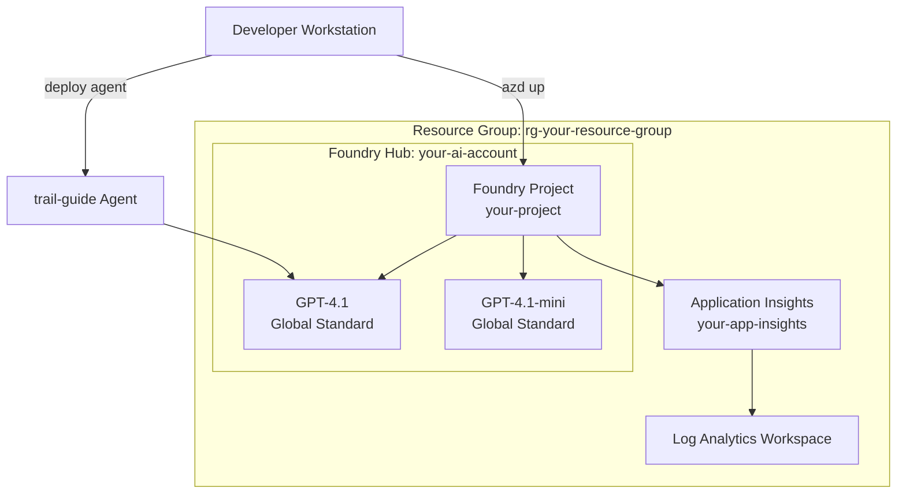

# Lab 08 -- Set Up Microsoft Foundry Project

## Overview

This lab provisions the GenAIOps infrastructure using a single `azd up` command, deploys a trail-guide AI agent, and verifies end-to-end connectivity. The Azure Developer CLI reads Bicep templates that declare every resource -- from the Foundry hub down to model deployments and monitoring.



## Prerequisites

- Lab 00 completed (all tools verified)
- Azure subscription with Contributor access
- GitHub account (for template repo)

## What Was Done

### Step 1 -- Create Repository from Template

**What:** Created a new repository from the Microsoft GenAIOps lab template on GitHub, then cloned it locally.

```bash
git clone <your-repo-url>
cd mslearn-genaiops
```

**Why:** The template repo contains Bicep IaC files, agent scripts, evaluation datasets, and GitHub Actions workflows. Starting from the template ensures a consistent baseline.

**Result:** Local repo ready with all lab source files.

**Exam Tip:** The exam tests understanding of infrastructure-as-code. Bicep is Azure's domain-specific language for declaring resources declaratively -- it compiles to ARM templates but is more readable.

---

### Step 2 -- Authenticate with Azure

**What:** Logged in with both `azd` and `az` CLIs.

```bash
azd auth login
az login
```

**Why:** `azd` needs credentials to provision infrastructure. `az` needs credentials for resource management and RBAC operations. They use the same underlying identity but maintain separate token caches.

**Result:** Both CLIs authenticated against the same Azure subscription.

**Exam Tip:** For CI/CD pipelines, interactive login is replaced with OIDC federated credentials or service principals. The exam may ask which authentication method is appropriate for automated deployments.

---

### Step 3 -- Provision Infrastructure with azd up

**What:** Ran `azd up` to provision all Azure resources from Bicep templates.

```bash
azd up
```

When prompted:
- **Environment name:** your-environment-name
- **Subscription:** (selected active subscription)
- **Region:** Sweden Central

**Why:** `azd up` does three things in sequence: (1) packages application code, (2) provisions infrastructure via Bicep, (3) deploys application artifacts. The Bicep templates declare the complete resource graph.

**What Bicep provisions:**

| Resource | Purpose |
|----------|---------|
| **AI Foundry Hub** | Top-level container for AI projects; manages shared resources like connections and compute |
| **AI Foundry Project** | Workspace scoped to this lab series; isolates agents, evaluations, and deployments |
| **GPT-4.1** (Global Standard) | Primary model for the trail-guide agent |
| **GPT-4.1-mini** (Global Standard) | Cost-optimized model used in experiment comparisons |
| **Application Insights** | Collects telemetry, traces, and custom metrics from agent interactions |
| **Log Analytics Workspace** | Backend store for Application Insights; enables KQL queries |

**Result:** All resources provisioned in the selected resource group and region.

**Exam Tip:** Understand the Foundry hierarchy: **Hub > Project > Agent/Deployment**. A hub is a shared governance boundary (think of it like a Databricks Account). A project is a workspace scoped to a team or application. Model deployments live inside the hub but are accessible from projects. The exam distinguishes between **Global Standard** (shared capacity, pay-per-token, best for dev/test) and **Provisioned** (reserved throughput, fixed cost, best for production).

---

### Step 4 -- Generate .env File

**What:** Generated environment variables from azd output.

```bash
azd env get-values > .env
```

**Why:** The `.env` file provides connection strings, endpoints, and resource names to all Python scripts. This avoids hardcoding infrastructure details.

**Result:** `.env` file created with keys like `PROJECT_ENDPOINT`, `MODEL_DEPLOYMENT_NAME`, `APPLICATIONINSIGHTS_CONNECTION_STRING`.

Key values:
- `PROJECT_ENDPOINT=https://<your-ai-account>.services.ai.azure.com/api/projects/<your-project>`
- `MODEL_DEPLOYMENT_NAME=gpt-4.1`

---

### Step 5 -- Create Virtual Environment and Install Dependencies

**What:** Set up a Python virtual environment and installed required packages.

```bash
python3 -m venv .venv
source .venv/bin/activate
pip install -r requirements.txt
```

**Why:** Isolating dependencies in a venv prevents conflicts with system Python. The requirements include `azure-ai-projects`, `azure-ai-evaluation`, `azure-identity`, and `opentelemetry` packages.

**Result:** All dependencies installed. Verified with `pip list`.

---

### Step 6 -- Deploy the Trail-Guide Agent

**What:** Ran the agent deployment script to create the trail-guide agent in the Foundry project.

```bash
python src/api/trail_guide_agent.py
```

**Why:** This script uses the Azure AI Projects SDK to create an agent with a system prompt (the trail-guide instructions), associate it with the GPT-4.1 model deployment, and register it in the Foundry project.

**Result:** Agent `trail-guide` deployed. Agent ID printed to console.

**Exam Tip:** An agent in Foundry is a stateful resource -- it persists its system prompt, model binding, and tool definitions. This differs from a stateless API call where you send the system prompt on every request.

---

### Step 7 -- Test the Agent Interactively

**What:** Ran the interactive test script to converse with the deployed agent.

```bash
python src/api/interact_with_agent.py
```

**Why:** Validates end-to-end connectivity: local script -> Foundry endpoint -> GPT-4.1 model -> response. If this works, the full stack is healthy.

**Result:** Agent responded to trail-guide queries with relevant hiking advice. Conversation thread created successfully.

---

### Step 8 -- Verify in Azure AI Foundry Portal

**What:** Opened the Foundry portal and verified:
1. Hub visible under the subscription
2. Project listed under the hub
3. Model deployments (GPT-4.1, GPT-4.1-mini) active
4. Trail-guide agent visible in the Agents section

**Why:** The portal provides a GUI view of everything provisioned via IaC. It is also where you review evaluation results and traces in later labs.

**Result:** All resources confirmed in the portal.

## Key Takeaways

- **`azd up` is a single command** that provisions the entire GenAIOps stack from Bicep templates -- hub, project, models, monitoring
- **Foundry Hub vs Project:** The hub is the shared governance boundary; the project is the scoped workspace where agents and evaluations live
- **Global Standard deployments** use shared multi-tenant capacity with pay-per-token pricing -- ideal for development and experimentation
- **The .env file** bridges infrastructure and application code -- scripts read connection details from it rather than hardcoding values
- **Agents are persistent resources** in Foundry, not ephemeral API calls -- they maintain their prompt, model binding, and configuration

## Resources Created

| Resource | Type | Purpose |
|----------|------|---------|
| Your resource group | Resource Group | Container for all lab resources |
| Your AI account | AI Foundry Hub | Shared governance and resource management |
| Your project | AI Foundry Project | Scoped workspace for agents and evaluations |
| GPT-4.1 | Model Deployment (Global Standard) | Primary model for trail-guide agent |
| GPT-4.1-mini | Model Deployment (Global Standard) | Cost-optimized model for experiments |
| Your App Insights instance | Application Insights | Telemetry and trace collection |
| Log Analytics Workspace | Log Analytics | Backend for Application Insights queries |
| trail-guide | AI Agent | Hiking trail assistant (V1) |
