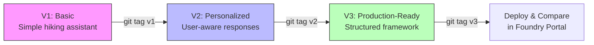

# Lab 09 -- Develop Prompt and Agent Versions

## Overview

This lab walks through the evolution of the trail-guide agent across three prompt versions, using Git tags to track each iteration. The goal is to understand how prompts mature from a basic prototype to a production-ready system prompt, and how version control provides an audit trail for every change.



## Prerequisites

- Lab 08 completed (Foundry project provisioned, trail-guide V1 deployed)
- Virtual environment activated with dependencies installed
- `.env` file generated

## What Was Done

### Step 1 -- Understand the V1 Prompt (Baseline)

**What:** Reviewed the initial trail-guide system prompt -- a basic instruction set.

**V1 characteristics:**
- Simple role definition ("You are a hiking trail guide assistant")
- Generic response style
- No personalization or structured output
- Minimal guardrails

**Why:** V1 establishes a working baseline. It proves the agent functions end-to-end but lacks the specificity needed for consistent, high-quality responses.

**Result:** Agent responds to hiking queries but with inconsistent depth, format, and tone.

**Exam Tip:** A baseline prompt is essential for measuring improvement. Without V1 metrics, you cannot quantify whether V2 or V3 is objectively better.

---

### Step 2 -- Deploy V2 Prompt (Personalized)

**What:** Updated the system prompt to include personalization capabilities and deployed V2.

```bash
python src/api/trail_guide_agent.py
git add .
git commit -m "Deploy trail-guide V2 with personalization"
git tag v2
```

**V2 additions over V1:**
- Asks clarifying questions about user experience level
- Tailors recommendations based on fitness level, group size, time of year
- More conversational tone
- Better handling of safety considerations

**Why:** V2 addresses the biggest gap in V1 -- generic responses that ignore the user's context. Personalization is a key differentiator for production agents.

**Result:** Agent now asks follow-up questions and adjusts recommendations based on user profile. Responses are more relevant but can be verbose.

**Exam Tip:** The exam may present scenarios where you must choose between prompt iterations. Personalization improves Relevance scores but can increase token usage and latency.

---

### Step 3 -- Deploy V3 Prompt (Production-Ready)

**What:** Deployed the production-ready V3 prompt with a structured response framework.

```bash
python src/api/trail_guide_agent.py
git add .
git commit -m "Deploy trail-guide V3 with structured framework"
git tag v3
```

**V3 additions over V2:**
- Structured output framework (consistent sections in responses)
- Explicit safety guidelines and disclaimers
- Token-conscious response formatting
- Grounding instructions (stick to known trail data, do not hallucinate)
- Edge case handling (weather warnings, permit requirements, accessibility)

**Why:** V3 is designed for production deployment where consistency, safety, and groundedness matter. The structured framework ensures every response covers the same critical sections regardless of the query.

**Result:** Agent produces well-structured, grounded responses with consistent formatting. Responses include safety sections and are more concise.

**Exam Tip:** Production prompts should include **grounding instructions** that explicitly tell the model to stay within its knowledge boundary. The AI-300 tests understanding of Groundedness as an evaluation metric -- it measures whether the response stays faithful to provided context.

---

### Step 4 -- Tag and Track Versions with Git

**What:** Applied Git tags to mark each version for reproducibility.

```bash
git tag -a v1 -m "Trail-guide V1: basic assistant"
git tag -a v2 -m "Trail-guide V2: personalized responses"
git tag -a v3 -m "Trail-guide V3: production-ready structured framework"
git tag -l
```

**Why:** Git tags create immutable reference points. You can always check out a specific version to reproduce results, roll back to a known-good state, or compare prompts across versions. This is the foundation of prompt version management in a GenAIOps workflow.

**Result:** Three tags (v1, v2, v3) created. Any version can be checked out with `git checkout v1`.

**Exam Tip:** The exam may ask about version management strategies for prompts. Key concepts: (1) Git tags for release versions, (2) branches for experiments, (3) main branch as the production truth. This mirrors MLOps model versioning -- prompts are the "model" in GenAIOps.

---

### Step 5 -- Compare Versions in Foundry Portal

**What:** Opened the Azure AI Foundry portal and compared agent behavior across versions.

**Why:** The portal provides a side-by-side view of agent responses, showing how the same input query produces different outputs across versions. This visual comparison complements the quantitative evaluation done in later labs.

**Result:** Clear progression visible:

| Aspect | V1 | V2 | V3 |
|--------|----|----|----| 
| Personalization | None | Asks clarifying questions | Context-aware responses |
| Structure | Freeform | Semi-structured | Consistent framework |
| Safety | Minimal | Basic warnings | Explicit safety sections |
| Grounding | None | Implicit | Explicit grounding instructions |
| Token Efficiency | Unpredictable | Verbose | Optimized |

## Key Takeaways

- **Prompt evolution follows a pattern:** basic -> personalized -> production-ready; each stage addresses specific quality gaps
- **Git tags are the version control mechanism** for prompts -- they create immutable, reproducible reference points equivalent to model versions in MLOps
- **V3's structured framework** ensures consistency by mandating specific response sections, which directly improves Groundedness and Relevance evaluation scores
- **Grounding instructions** are critical for production prompts -- they explicitly constrain the model to stay within its knowledge boundary and reduce hallucination
- **Version management enables rollback** -- if V3 degrades on a metric, you can redeploy V2 while investigating, just like rolling back a model deployment

## Resources Created

| Resource | Type | Purpose |
|----------|------|---------|
| trail-guide V1 | Agent Version | Basic hiking assistant (baseline) |
| trail-guide V2 | Agent Version | Personalized, user-aware responses |
| trail-guide V3 | Agent Version | Production-ready with structured framework |
| v1, v2, v3 | Git Tags | Immutable version reference points |
