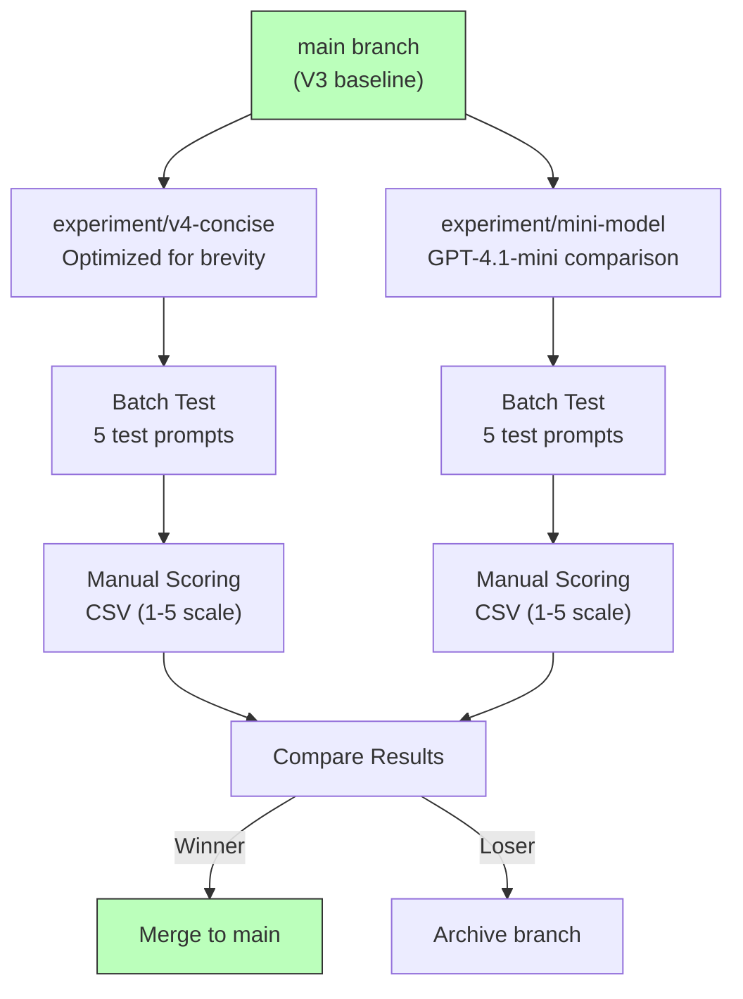

# Lab 10 -- Design and Optimize Prompts

## Overview

This lab introduces a rigorous experiment workflow for prompt optimization. Starting from the V3 baseline, we create experiment branches, run batch tests against 5 standardized prompts, manually score results on a 1-5 scale across three criteria, and merge the winning experiment back to main. The standout result: V4 achieves a 42% token reduction while maintaining quality.



## Prerequisites

- Lab 09 completed (V1-V3 deployed and tagged)
- Virtual environment activated
- `.env` file configured

## What Was Done

### Step 1 -- Establish Baseline with Batch Tests

**What:** Ran batch tests on the V3 prompt against 5 standardized test prompts.

```bash
python src/api/run_batch_tests.py
```

**The 5 test prompts:**

| Test ID | Scenario | Tests For |
|---------|----------|-----------|
| day-hike-gear | "What gear do I need for a day hike?" | Basic knowledge, completeness |
| overnight-camping | "Planning an overnight camping trip" | Multi-step planning, detail depth |
| three-day-backpacking | "Three-day backpacking trip essentials" | Extended planning, prioritization |
| winter-hiking | "Winter hiking preparation" | Safety-critical advice, conditions |
| trail-difficulty | "How do I assess trail difficulty?" | Technical knowledge, grading systems |

**Why:** Batch tests provide a repeatable, standardized evaluation. Running the same 5 prompts against every version ensures apples-to-apples comparison. This is the GenAIOps equivalent of a regression test suite.

**Result:** V3 baseline responses generated and saved. These become the comparison target for all experiments.

**Exam Tip:** The exam tests whether you understand why standardized test sets matter. If you change the test prompts between versions, you cannot attribute score differences to the prompt change versus the test change. Control your variables.

---

### Step 2 -- Create Experiment Branch (V4 Concise)

**What:** Created a Git branch for the V4 concise experiment.

```bash
git checkout -b experiment/v4-concise
```

Modified the trail-guide system prompt to add explicit conciseness instructions:
- Maximum response length guidelines
- Bullet-point formatting preference
- "Be direct" instruction
- Reduced preamble and filler text

Then deployed the updated agent:

```bash
python src/api/trail_guide_agent.py
```

**Why:** Token usage directly impacts cost and latency. If we can reduce tokens without sacrificing quality, we improve the agent's production economics. The experiment branch isolates this change so it does not affect the main branch.

**Result:** V4 agent deployed with conciseness-optimized prompt. Branch isolated from main.

**Exam Tip:** Experiment branches follow the same pattern as ML feature branches -- isolate one variable, test, measure, decide. The exam may ask about A/B testing strategies for prompts; Git branches are the version control mechanism that enables this.

---

### Step 3 -- Run Batch Tests on Experiment

**What:** Ran the same 5 batch tests against the V4 concise prompt.

```bash
python src/api/run_batch_tests.py
```

**Why:** Using the identical test set from Step 1 ensures the only variable is the prompt change. This is the core of controlled experimentation.

**Result:** V4 responses generated. Noticeably shorter while covering the same topics.

---

### Step 4 -- Manual Scoring with CSV

**What:** Scored all responses on a 1-5 scale across three evaluation criteria using a CSV spreadsheet.

**Scoring criteria:**

| Criterion | What It Measures | Scale |
|-----------|-----------------|-------|
| **Intent Resolution** | Does the response correctly address what the user asked? | 1 (missed intent) to 5 (fully resolved) |
| **Relevance** | Is all content in the response relevant to the query? No off-topic filler? | 1 (mostly irrelevant) to 5 (fully relevant) |
| **Groundedness** | Does the response stay grounded in factual knowledge? No hallucinations? | 1 (fabricated) to 5 (fully grounded) |

**Why:** Manual scoring provides ground-truth labels. Automated evaluators (Lab 11) are calibrated against human judgment. Understanding the rubric is essential for designing evaluation datasets.

**Result:** CSV file with 15 rows (5 tests x 3 criteria) per version.

**Exam Tip:** The AI-300 tests these three evaluation criteria extensively. Know the definitions cold. Intent Resolution = did you answer the right question? Relevance = is everything in the response useful? Groundedness = is it factually accurate and not hallucinated?

---

### Step 5 -- Run GPT-4.1-mini Comparison Experiment

**What:** Created a second experiment branch to test the same V3 prompt on GPT-4.1-mini.

```bash
git checkout main
git checkout -b experiment/mini-model
```

Updated `.env` to point at GPT-4.1-mini, ran batch tests, and scored.

**Why:** Model selection is another optimization lever. If GPT-4.1-mini produces comparable quality at lower cost, it may be the better production choice for this use case.

**Result:** GPT-4.1-mini responses generated and scored. Quality was acceptable but slightly lower on Groundedness for complex scenarios (winter-hiking, three-day-backpacking).

**Exam Tip:** The exam may present a scenario asking you to choose between a larger and smaller model. The decision framework: if quality metrics meet your threshold on the smaller model, use it for cost savings. If they do not, the larger model is justified.

---

### Step 6 -- Compare Experiments and Select Winner

**What:** Compared scores across all experiments.

**Results summary:**

| Version | Avg Intent Resolution | Avg Relevance | Avg Groundedness | Avg Token Count | Token Change |
|---------|----------------------|---------------|------------------|-----------------|--------------|
| V3 (baseline) | 4.2 | 3.8 | 4.0 | ~850 | -- |
| V4 (concise) | 4.2 | 4.4 | 4.0 | ~490 | **-42%** |
| V3 on mini | 3.8 | 3.6 | 3.4 | ~780 | -8% |

**Why:** The comparison table makes the winner obvious. V4 concise maintains Intent Resolution and Groundedness, improves Relevance (by removing filler), and achieves a 42% token reduction.

**Result:** V4 concise selected as the winner. GPT-4.1-mini experiment archived.

**Exam Tip:** Token reduction without quality loss is a key optimization pattern. The 42% reduction means 42% lower cost and faster response times. The exam may ask you to calculate cost implications of token reduction.

---

### Step 7 -- Merge Winning Experiment to Main

**What:** Merged the winning experiment branch back to main and tagged V4.

```bash
git checkout main
git merge experiment/v4-concise
git tag -a v4 -m "Trail-guide V4: concise optimized (42% token reduction)"
git branch -d experiment/v4-concise
```

**Why:** Merging to main promotes the experiment to the production-candidate branch. The tag marks this as a release version. The experiment branch is deleted to keep the branch list clean.

**Result:** V4 is now the latest version on main. Tagged as v4.

**Exam Tip:** The merge-to-main pattern mirrors MLOps model promotion. In GenAIOps: experiment branch = training run, batch test = validation, merge = model registration, deployment from main = production deployment.

## Key Takeaways

- **Experiment branches isolate one variable at a time** -- change the prompt OR the model, never both simultaneously, so you can attribute improvements to the correct change
- **The 42% token reduction** from V4 concise demonstrates that prompt engineering is a cost optimization lever, not just a quality lever
- **Manual scoring with a defined rubric** (Intent Resolution, Relevance, Groundedness on 1-5) provides the ground truth that automated evaluators are calibrated against
- **Model downsizing** (GPT-4.1 to GPT-4.1-mini) is a valid experiment but must pass quality thresholds -- cheaper is only better if quality is sufficient
- **The experiment workflow** (branch -> test -> score -> compare -> merge/archive) is the GenAIOps equivalent of the MLOps training pipeline

## Resources Created

| Resource | Type | Purpose |
|----------|------|---------|
| trail-guide V4 | Agent Version | Concise-optimized prompt (42% token reduction) |
| v4 | Git Tag | Marks the optimized concise version |
| Batch test results | CSV Files | Scored responses for V3, V4, and mini experiments |
| experiment/v4-concise | Git Branch (merged) | Isolated prompt optimization experiment |
| experiment/mini-model | Git Branch (archived) | Model comparison experiment |
