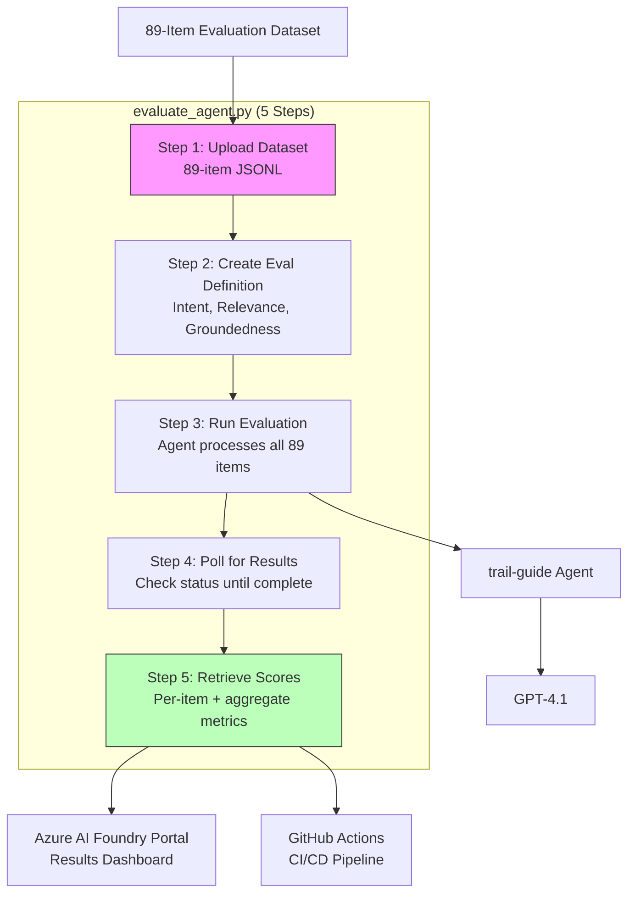

# Lab 11 -- Automated Evaluation with Cloud Evaluators

## Overview

This lab replaces the manual scoring from Lab 10 with automated cloud-based evaluators. The `evaluate_agent.py` script orchestrates a 5-step pipeline: upload dataset, define evaluation criteria, run the evaluation, poll for completion, and retrieve scores. An 89-item evaluation dataset provides statistically meaningful coverage, and GitHub Actions with OIDC federated credentials enable fully automated CI/CD evaluation.



## Prerequisites

- Lab 10 completed (V4 deployed and tagged)
- Virtual environment activated
- `.env` file configured
- Azure AI Foundry project accessible

## What Was Done

### Step 1 -- Understand the 89-Item Evaluation Dataset

**What:** Reviewed the evaluation dataset -- an 89-item JSONL file containing diverse trail-guide queries with expected response characteristics.

**Why:** The 5-item batch test from Lab 10 was useful for rapid iteration but too small for statistical confidence. The 89-item dataset covers edge cases, varying complexity levels, and different user intents.

**Dataset coverage includes:**
- Simple factual queries (gear lists, trail ratings)
- Complex planning scenarios (multi-day trips, group logistics)
- Safety-critical questions (weather hazards, emergency protocols)
- Ambiguous queries (tests intent resolution)
- Out-of-scope queries (tests grounding -- should the agent refuse?)

**Result:** Dataset reviewed and ready for upload.

**Exam Tip:** The exam may ask about evaluation dataset design. Key principles: (1) cover the full distribution of expected user queries, (2) include edge cases and adversarial inputs, (3) include queries where the correct answer is "I don't know" to test grounding.

---

### Step 2 -- Walk Through evaluate_agent.py (5 Steps)

**What:** Reviewed the evaluation script's architecture -- a 5-step pipeline.

#### Step 1 in script: Upload Dataset

```python
# Uploads the 89-item JSONL to the Foundry project as a dataset asset
dataset = client.datasets.upload_file(
    name="trail-guide-eval-dataset",
    file_path="data/evaluation_dataset.jsonl"
)
```

The dataset is registered as a versioned asset in the Foundry project, enabling reproducible evaluations.

#### Step 2 in script: Create Evaluation Definition

```python
# Defines WHICH evaluators to run and HOW to map data fields
evaluation = EvaluationDefinition(
    evaluators={
        "intent_resolution": IntentResolutionEvaluator(),
        "relevance": RelevanceEvaluator(),
        "groundedness": GroundednessEvaluator()
    },
    data_mapping={
        "query": "${data.query}",
        "response": "${data.response}",
        "context": "${data.context}"
    }
)
```

#### Step 3 in script: Run Evaluation

Submits the evaluation job. The Foundry service processes all 89 items through the agent and scores each response with the three evaluators.

#### Step 4 in script: Poll for Results

```python
# Checks evaluation status every 30 seconds until complete
while status != "Completed":
    status = client.evaluations.get(eval_id).status
    time.sleep(30)
```

#### Step 5 in script: Retrieve Scores

Fetches per-item scores and aggregate metrics. Prints summary statistics.

**Why:** Understanding the 5-step pipeline is critical because the exam tests each component. The `data_mapping` is particularly important -- it tells the evaluator which fields in your dataset correspond to query, response, and context.

**Result:** Script architecture understood.

**Exam Tip:** The `data_mapping` parameter is a common exam topic. It uses `${data.field_name}` syntax to bind dataset columns to evaluator inputs. If your dataset uses different column names (e.g., "question" instead of "query"), the mapping must reflect that.

---

### Step 3 -- Run the Automated Evaluation

**What:** Executed the evaluation script against the trail-guide V4 agent.

```bash
python src/api/evaluate_agent.py
```

**Why:** This replaces the manual CSV scoring from Lab 10. Instead of a human scoring 5 items on 3 criteria (15 judgments), the cloud evaluators score 89 items on 3 criteria (267 judgments) automatically.

**Result:** Evaluation completed. Aggregate scores returned:

| Evaluator | Aggregate Score | Interpretation |
|-----------|----------------|----------------|
| Intent Resolution | 4.3/5 | Agent correctly addresses user intent in most cases |
| Relevance | 4.5/5 | Responses are highly relevant, minimal filler |
| Groundedness | 4.1/5 | Responses stay grounded; rare hallucination on edge cases |

**Exam Tip:** Know the three built-in evaluators and what they measure:
- **Intent Resolution:** Does the response answer the question that was asked?
- **Relevance:** Is every part of the response relevant to the query?
- **Groundedness:** Is the response factually supported by the provided context?

These are LLM-as-judge evaluators -- they use a separate LLM call to score the agent's response.

---

### Step 4 -- Set Up GitHub Actions with OIDC Federated Credentials

**What:** Configured a GitHub Actions workflow to run evaluations automatically on push to main.

Steps:
1. Created an Azure AD app registration
2. Added a federated credential scoped to the GitHub repo's main branch
3. Stored `AZURE_CLIENT_ID`, `AZURE_TENANT_ID`, and `AZURE_SUBSCRIPTION_ID` as GitHub Actions secrets
4. Created a workflow YAML that runs `evaluate_agent.py` on every push to main

```yaml
# .github/workflows/evaluate.yml (simplified)
on:
  push:
    branches: [main]

permissions:
  id-token: write
  contents: read

jobs:
  evaluate:
    runs-on: ubuntu-latest
    steps:
      - uses: actions/checkout@v4
      - uses: azure/login@v2
        with:
          client-id: ${{ secrets.AZURE_CLIENT_ID }}
          tenant-id: ${{ secrets.AZURE_TENANT_ID }}
          subscription-id: ${{ secrets.AZURE_SUBSCRIPTION_ID }}
      - run: pip install -r requirements.txt
      - run: python src/api/evaluate_agent.py
```

**Why:** Automated evaluation on every merge to main ensures no prompt regression reaches production. OIDC federated credentials avoid storing long-lived secrets -- the GitHub Actions runner exchanges a short-lived OIDC token for an Azure access token.

**Result:** GitHub Actions workflow configured. Every push to main triggers a full 89-item evaluation.

**Exam Tip:** OIDC federated credentials are the recommended authentication method for CI/CD. The exam tests this over service principal secrets. Key advantage: no secret rotation needed, no long-lived credentials stored.

---

### Step 5 -- Review Results in Azure Portal

**What:** Opened the Azure AI Foundry portal to review evaluation results visually.

**Why:** The portal provides dashboards showing per-item scores, score distributions, and trend lines across evaluation runs. This is essential for identifying specific failure cases.

**Result:** Evaluation results visible in the Foundry portal under the project's Evaluations section. Individual items with low Groundedness scores identified for prompt refinement.

## Key Takeaways

- **The 5-step evaluation pipeline** (upload, define, run, poll, retrieve) is the standard pattern for automated evaluation in Azure AI Foundry
- **`data_mapping`** binds your dataset columns to evaluator inputs -- getting this wrong silently produces meaningless scores
- **89 items provides statistical significance** that 5 items cannot -- automated evaluation makes large datasets practical
- **OIDC federated credentials** are the exam-recommended authentication method for CI/CD pipelines -- no stored secrets, no rotation
- **LLM-as-judge evaluators** use a separate model call to score responses, which means evaluation has its own cost and latency -- budget accordingly

## Resources Created

| Resource | Type | Purpose |
|----------|------|---------|
| trail-guide-eval-dataset | Dataset Asset | 89-item JSONL registered in Foundry project |
| Evaluation run | Evaluation Job | Automated scoring of V4 agent on 89 items |
| Azure AD App Registration | Identity | Service principal for GitHub Actions OIDC |
| Federated Credential | OIDC Config | Binds GitHub repo to Azure AD app |
| .github/workflows/evaluate.yml | GitHub Actions | CI/CD pipeline for automated evaluation |
