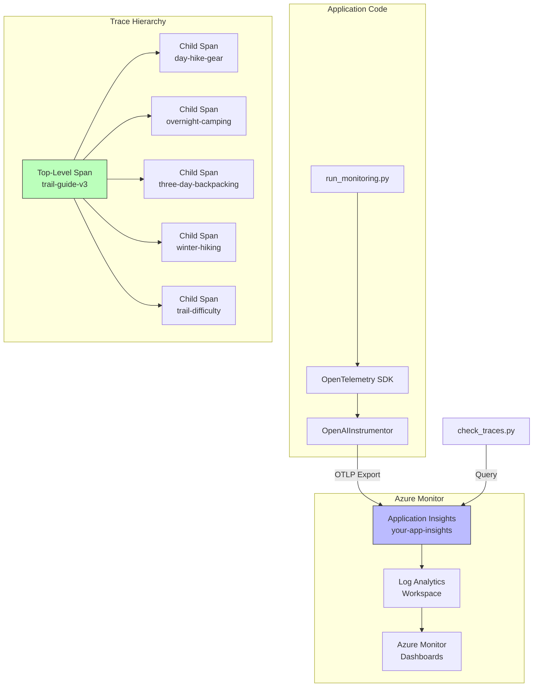

# Lab 12 -- Monitor and Trace Your GenAI Agent

## Overview

This lab instruments the trail-guide agent with OpenTelemetry to emit traces and metrics to Application Insights. The `run_monitoring.py` script creates a hierarchical span structure -- one top-level span per agent version, with child spans for each test prompt -- enabling side-by-side comparison of versions in Azure Monitor. The `check_traces.py` script queries and displays the resulting trace trees.



## Prerequisites

- Lab 11 completed (automated evaluation configured)
- Virtual environment activated
- `.env` file configured with `APPLICATIONINSIGHTS_CONNECTION_STRING`
- Application Insights resource provisioned

## What Was Done

### Step 1 -- Understand the Monitoring Architecture

**What:** Reviewed the telemetry pipeline: OpenTelemetry SDK -> Azure Monitor Exporter -> Application Insights -> Log Analytics.

**Components:**

| Component | Role |
|-----------|------|
| **OpenTelemetry SDK** | Industry-standard observability framework; provides tracing, metrics, and logging APIs |
| **OpenAIInstrumentor** | Auto-instruments Azure OpenAI SDK calls to capture request/response details, token counts, and latency |
| **Azure Monitor Exporter** | Ships telemetry from the OpenTelemetry SDK to Application Insights |
| **Application Insights** | Stores traces, metrics, and logs; provides query and visualization |
| **Log Analytics Workspace** | Backend data store; supports KQL queries for advanced analysis |

**Why:** Understanding the full pipeline is essential for debugging when traces do not appear. Each component can fail independently -- the SDK might not be configured, the exporter might not have the connection string, or App Insights might have ingestion delays.

**Result:** Architecture understood.

**Exam Tip:** The exam tests the OpenTelemetry -> Application Insights pipeline. OpenTelemetry is vendor-neutral (not Azure-specific) and the Azure Monitor Exporter is the bridge to Azure's monitoring stack. Common exam question: "Which component exports OpenTelemetry data to Application Insights?"

---

### Step 2 -- Review run_monitoring.py Script

**What:** Walked through the monitoring script's key sections.

#### Configure Azure Monitor

```python
from azure.monitor.opentelemetry import configure_azure_monitor

configure_azure_monitor(
    connection_string=os.getenv("APPLICATIONINSIGHTS_CONNECTION_STRING")
)
```

This one-liner sets up the entire export pipeline -- creates a tracer provider, registers the Azure Monitor exporter, and configures standard resource attributes.

#### Instrument OpenAI Calls

```python
from opentelemetry.instrumentation.openai import OpenAIInstrumentor

OpenAIInstrumentor().instrument()
```

This auto-instruments every Azure OpenAI SDK call to emit spans with token counts, model name, latency, and request/response content.

#### Create Hierarchical Spans

```python
tracer = trace.get_tracer(__name__)

for version in ["v1", "v2", "v3", "v4"]:
    with tracer.start_as_current_span(f"trail-guide-{version}") as parent_span:
        for test in test_prompts:
            with tracer.start_as_current_span(f"test-{test['id']}") as child_span:
                # Run agent with test prompt
                response = agent.run(test["query"])
                child_span.set_attribute("test.id", test["id"])
                child_span.set_attribute("response.token_count", response.usage.total_tokens)
```

**Why:** The hierarchical span structure is the key design decision. Top-level spans group by version, child spans group by test. This enables Azure Monitor queries like "compare average latency of v3 vs v4" or "find which test prompt caused the highest token usage in v4."

**Result:** Script architecture understood.

**Exam Tip:** Span hierarchies are a core OpenTelemetry concept. A span has a parent (unless it is a root span), a start time, an end time, and attributes. The exam may ask you to identify the correct span hierarchy for a given scenario. Parent spans measure the aggregate; child spans measure individual operations.

---

### Step 3 -- Run the Monitoring Script

**What:** Executed the monitoring script to generate traces for all agent versions.

```bash
python src/api/run_monitoring.py
```

**Why:** This generates the telemetry data that populates Azure Monitor. Without running this, Application Insights has no agent-specific traces to display.

**Result:** Script ran all 4 versions x 5 test prompts = 20 agent interactions. Each interaction generated a child span under the appropriate version's top-level span. Total: 4 top-level spans, 20 child spans, plus auto-instrumented OpenAI SDK spans nested within.

**Exam Tip:** There is an ingestion delay of 2-5 minutes between when telemetry is emitted and when it appears in Application Insights. The exam may ask about this -- do not assume real-time visibility.

---

### Step 4 -- View Trace Trees with check_traces.py

**What:** Ran the trace inspection script to view the hierarchical trace trees.

```bash
python src/api/check_traces.py
```

**Why:** This script queries Application Insights and renders the trace tree in the terminal, showing parent-child relationships, durations, and token counts. It provides a quick local view without opening the Azure portal.

**Result:** Trace trees displayed showing:
- Each version as a top-level span with total duration
- Each test prompt as a child span with individual duration and token count
- OpenAI SDK auto-instrumented spans nested within child spans (showing model name, completion tokens, prompt tokens)

---

### Step 5 -- Analyze Resource Usage in Azure Monitor

**What:** Opened Azure Monitor in the portal to analyze token counts, request counts, and latency across versions.

**Metrics reviewed:**

| Metric | V3 | V4 | Observation |
|--------|----|----|-------------|
| Avg tokens per response | ~850 | ~490 | 42% reduction confirmed by telemetry |
| Avg latency per request | ~2.1s | ~1.4s | Faster due to fewer output tokens |
| Total token consumption (5 tests) | ~4,250 | ~2,450 | Direct cost impact |
| Error rate | 0% | 0% | No regressions |

**Why:** Monitoring data provides production-grade evidence that V4's token reduction translates to real latency and cost improvements. Evaluation scores (Lab 11) tell you about quality; monitoring tells you about operational performance.

**Result:** V4 confirmed as operationally superior to V3 on all measurable axes.

**Exam Tip:** The exam distinguishes between **evaluation** (quality metrics like Groundedness) and **monitoring** (operational metrics like latency, token count, error rate). You need both for a complete GenAIOps picture. Evaluation answers "is it good?" Monitoring answers "is it healthy?"

---

### Step 6 -- Compare Versions in Azure Monitor

**What:** Used KQL queries in Log Analytics to compare versions side by side.

```kusto
traces
| where message startswith "trail-guide-"
| summarize avg_duration = avg(duration), avg_tokens = avg(toint(customDimensions["response.token_count"]))
    by version = tostring(split(message, "-")[2])
| order by version asc
```

**Why:** KQL enables custom aggregations that go beyond the portal's built-in dashboards. For the exam, know that Log Analytics is where you write KQL, and Application Insights is the data source.

**Result:** Cross-version comparison table generated from live telemetry data.

## Key Takeaways

- **OpenTelemetry is the instrumentation standard** -- it is vendor-neutral, and the Azure Monitor Exporter bridges it to Application Insights
- **OpenAIInstrumentor auto-captures** token counts, latency, model name, and request/response content without manual code
- **Span hierarchies** (version -> test -> OpenAI call) enable both aggregate and drill-down analysis in Azure Monitor
- **Evaluation measures quality; monitoring measures operations** -- you need both for GenAIOps; a high-quality agent with 5-second latency is not production-ready
- **Telemetry ingestion has a 2-5 minute delay** -- do not assume real-time visibility when debugging traces in Application Insights

## Resources Created

| Resource | Type | Purpose |
|----------|------|---------|
| Trace data (V1-V4) | Application Insights Traces | Hierarchical spans for all agent versions |
| Custom metrics | Application Insights Metrics | Token counts, latency, request counts |
| KQL queries | Log Analytics | Cross-version comparison queries |
