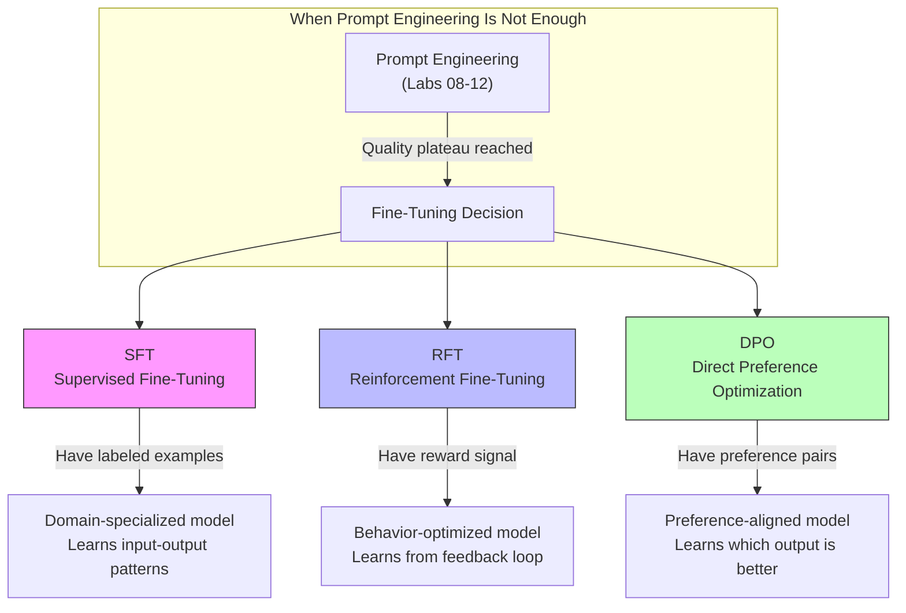

# Lab 13 -- Optimize AI Agents with Fine-Tuning

## Overview

This is a **conceptual lab** -- no hands-on coding. It covers the three fine-tuning methods tested on the AI-300 exam: Supervised Fine-Tuning (SFT), Reinforcement Fine-Tuning (RFT), and Direct Preference Optimization (DPO). The focus is on when to use each method and how they fit into the GenAIOps lifecycle established in Labs 08-12.



## Prerequisites

- Labs 08-12 completed (understanding of prompt engineering, evaluation, and monitoring)
- No Azure resources or code required for this lab

## What Was Done

### Step 1 -- Understand When Fine-Tuning Is Needed

**What:** Identified the decision point between continued prompt engineering and fine-tuning.

**When to stay with prompt engineering:**
- Evaluation scores are still improving with prompt changes
- The task is well-covered by the base model's training data
- You need rapid iteration (minutes, not hours/days)
- Budget and data are limited

**When to consider fine-tuning:**
- Evaluation scores have plateaued despite prompt optimization
- The domain requires specialized vocabulary or reasoning patterns
- Consistent output format is critical and prompting alone is unreliable
- Token usage needs to drop below what concise prompting achieves (fine-tuned models can internalize instructions)
- Latency requirements demand shorter prompts (fewer input tokens)

**Why:** Fine-tuning is not always the right answer. The GenAIOps workflow from Labs 08-12 (prompt versioning, experiment branches, automated evaluation) should be exhausted first because fine-tuning is more expensive, slower, and harder to iterate.

**Result:** Decision framework established.

**Exam Tip:** The exam presents scenarios asking whether to use prompt engineering or fine-tuning. The key deciding factor is whether evaluation scores have plateaued. If scores are still improving from prompt changes, fine-tuning is premature.

---

### Step 2 -- Supervised Fine-Tuning (SFT)

**What:** Reviewed SFT -- the most common fine-tuning approach.

**How SFT works:**
1. Prepare a dataset of (input, desired_output) pairs
2. Train the model to minimize the difference between its output and the desired output
3. The model learns to reproduce the patterns in your training data

**Data requirements:**
- Hundreds to thousands of labeled examples
- High-quality, consistent labels (garbage in = garbage out)
- Format: JSONL with `{"messages": [{"role": "system", ...}, {"role": "user", ...}, {"role": "assistant", ...}]}`

**Best for:**
- Domain adaptation (medical, legal, financial terminology)
- Consistent output formatting (always return JSON, always follow a template)
- Internalizing complex instructions that would otherwise consume prompt tokens
- Teaching the model specific knowledge not in its training data

**Trail-guide example:** If the agent needed to know about 500 specific trails with detailed conditions, SFT on a dataset of trail-specific Q&A pairs would be more effective than cramming all that data into the prompt.

**Why:** SFT is the most intuitive method -- it teaches by example. But it requires high-quality labeled data, which is expensive to create.

**Result:** SFT mechanics and use cases understood.

**Exam Tip:** The exam tests SFT data format. Know the JSONL messages format. Also know that SFT can cause **catastrophic forgetting** -- the model may lose general capabilities it had before fine-tuning. Mitigation: include general-purpose examples in the training set.

---

### Step 3 -- Reinforcement Fine-Tuning (RFT)

**What:** Reviewed RFT -- fine-tuning guided by a reward signal rather than explicit labels.

**How RFT works:**
1. Define a reward function (or use a reward model) that scores outputs
2. The model generates responses and receives reward scores
3. The model updates its weights to maximize reward
4. Iterates until the reward signal converges

**Data requirements:**
- A reward function or reward model (not labeled examples)
- Can use automated evaluators (like those from Lab 11) as reward signals
- Fewer labeled examples needed compared to SFT

**Best for:**
- Optimizing for metrics that are hard to demonstrate by example (e.g., "be more helpful")
- When you have a reliable automated evaluator but not enough labeled examples for SFT
- Improving reasoning capabilities (chain-of-thought quality)
- Aligning model behavior with complex, multi-faceted criteria

**Trail-guide example:** Use the Intent Resolution, Relevance, and Groundedness evaluators from Lab 11 as a composite reward signal. The model learns to maximize all three scores simultaneously without needing explicit "correct" answers.

**Why:** RFT bridges the gap between "I know good when I see it" (reward signal) and "I can show you exactly what good looks like" (SFT labels). It is more flexible but harder to control.

**Result:** RFT mechanics and use cases understood.

**Exam Tip:** The exam may ask about the relationship between evaluation and RFT. Key insight: the same evaluators you use for automated evaluation (Lab 11) can serve as reward signals for RFT. This is why building robust evaluators is doubly important -- they serve both quality measurement and training optimization.

---

### Step 4 -- Direct Preference Optimization (DPO)

**What:** Reviewed DPO -- fine-tuning from human preference pairs without an explicit reward model.

**How DPO works:**
1. Prepare a dataset of preference pairs: (input, preferred_output, rejected_output)
2. The model learns to assign higher probability to the preferred output and lower probability to the rejected output
3. No separate reward model needed -- the preference data directly optimizes the policy

**Data requirements:**
- Preference pairs: for each input, one "better" and one "worse" response
- Typically requires thousands of preference pairs
- Format: `{"prompt": "...", "chosen": "...", "rejected": "..."}`

**Best for:**
- Aligning with human preferences that are difficult to formalize as a reward function
- Style and tone control (formal vs. casual, concise vs. detailed)
- Safety alignment (preferred safe responses over unsafe ones)
- When you have comparative judgments but not absolute quality labels

**Trail-guide example:** Collect pairs where one response was rated higher by hikers than another for the same query. The model learns the implicit preferences without needing explicit scoring criteria.

**Why:** DPO is simpler than RFT because it does not require training a separate reward model. It works directly from preference data. But it requires high-quality preference pairs where the "better" and "worse" labels are consistent.

**Result:** DPO mechanics and use cases understood.

**Exam Tip:** The exam distinguishes DPO from RFT. Key difference: DPO uses **preference pairs** (A is better than B) and no reward model. RFT uses a **reward function** (score this output 0.8) and optimizes against it. DPO is simpler to implement but less flexible.

---

### Step 5 -- Compare All Three Methods

**What:** Built a comparison framework for selecting the right fine-tuning method.

| Criterion | SFT | RFT | DPO |
|-----------|-----|-----|-----|
| **Data needed** | Labeled (input, output) pairs | Reward function or reward model | Preference pairs (chosen, rejected) |
| **Data volume** | Hundreds to thousands | Fewer labeled examples | Thousands of pairs |
| **Complexity** | Low (straightforward training) | High (reward engineering) | Medium (pair collection) |
| **Best for** | Domain knowledge, format consistency | Metric optimization, reasoning | Style alignment, safety |
| **Risk** | Catastrophic forgetting | Reward hacking | Inconsistent preferences |
| **Iteration speed** | Fast (single training run) | Slow (reward model + policy training) | Medium |
| **When to choose** | You have good examples | You have good evaluators | You have good comparisons |

**Decision tree:**

1. Do you have high-quality (input, output) pairs? -> **SFT**
2. Do you have a reliable automated evaluator / reward signal? -> **RFT**
3. Do you have comparative judgments (A > B)? -> **DPO**
4. Do you have none of the above? -> **Stay with prompt engineering** until you do

**Why:** The exam presents scenarios and asks you to select the appropriate method. This comparison framework gives you the decision criteria.

**Result:** Comparison framework established.

**Exam Tip:** The most common exam pattern is a scenario question: "A team has 1,000 labeled examples of customer service responses in the correct format. Which fine-tuning method should they use?" Answer: SFT, because they have labeled (input, output) pairs. If they had preference rankings instead, the answer would be DPO.

---

### Step 6 -- Fine-Tuning in the GenAIOps Lifecycle

**What:** Positioned fine-tuning within the overall GenAIOps workflow from Labs 08-12.

```
Prompt Engineering (Labs 08-10)
    |
    v
Automated Evaluation (Lab 11)  <-- scores plateau?
    |                                    |
    | No: iterate prompts               | Yes: consider fine-tuning
    v                                    v
Monitoring (Lab 12)              Select method (SFT/RFT/DPO)
    |                                    |
    v                                    v
Production                        Fine-tune + re-evaluate
                                         |
                                         v
                                  Deploy fine-tuned model
                                         |
                                         v
                                  Monitor (Lab 12 pipeline)
```

**Why:** Fine-tuning does not replace the GenAIOps workflow -- it extends it. A fine-tuned model still needs versioning (Lab 09), evaluation (Lab 11), and monitoring (Lab 12). The only thing that changes is the model underneath.

**Result:** Fine-tuning positioned correctly within the GenAIOps lifecycle.

**Exam Tip:** The exam expects you to see fine-tuning as one tool in the optimization toolkit, not a standalone activity. A fine-tuned model without evaluation and monitoring is just as risky as a prompt-engineered model without them.

## Key Takeaways

- **Fine-tuning is a last resort, not a first step** -- exhaust prompt engineering before investing in data collection and training
- **SFT is the simplest method** and best when you have labeled (input, output) examples; risk is catastrophic forgetting
- **RFT uses a reward signal** (not labeled examples) and can leverage your existing automated evaluators as reward functions
- **DPO works from preference pairs** (chosen vs. rejected) without needing a reward model; best for style and alignment
- **Fine-tuning extends the GenAIOps lifecycle** -- a fine-tuned model still needs evaluation, versioning, and monitoring

## Resources Created

| Resource | Type | Purpose |
|----------|------|---------|
| N/A | N/A | This is a conceptual lab -- no Azure resources created |
